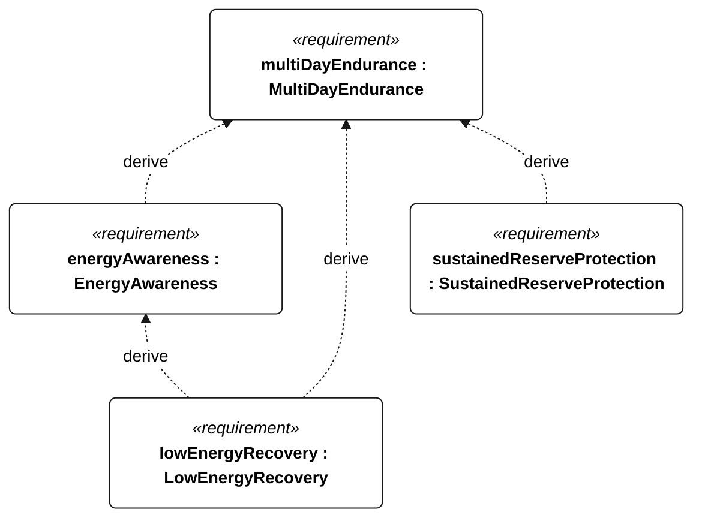
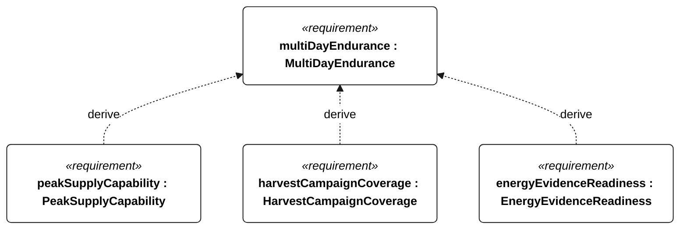

# M-002 multi day endurance

[All requirement views](<../requirements-views.md>)

[Qualification conditions, rationale, open issues and verification](<../requirements-context.md>)

**M-002 MultiDayEndurance** — The vessel shall operate for 72 continuous hours without servicing or external charging under the specified Gorge energy campaign.

**E-001 EnergyAwareness** — The vessel shall maintain conservative estimates of usable energy and protected recovery reserve.

**E-004 LowEnergyRecovery** — The vessel shall protect essential functions when conservative usable energy reaches the recovery reserve.

**E-201 SustainedReserveProtection** — Conservative stored energy shall remain strictly above the R-002 protected reserve throughout the selected sustained-operation profile.

**E-203 PeakSupplyCapability** — The battery supply shall support each selected mode’s coincident peak withdrawal power without harvesting.

**E-204 HarvestCampaignCoverage** — The qualification energy profile shall contain at least three consecutive 24-hour days, each with harvesting enabled for no more than 6 hours.

**E-205 EnergyEvidenceReadiness** — An energy case shall be accepted only after its installed-load coverage, resource bounds, battery derating and interval-resolution evidence have been accepted.

## M-002 derivation 1

## M-002 derivation 2

[Continue: E-001 energy awareness](<requirements-e-001.md>)

[Continue: E-004 low energy recovery](<requirements-e-004.md>)
