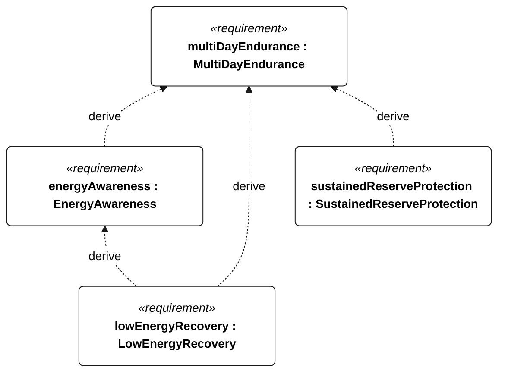
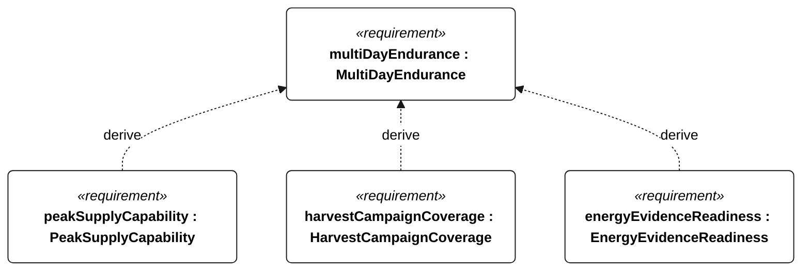

# M-002 multi day endurance

[All requirement views](<../requirements-views.md>)

**MultiDayEndurance** — The vessel shall operate for 72 continuous hours without servicing or external charging while meeting the Gorge operational functions under N-010 and the applicable shared N-001 conditions. A qualification run shall include three consecutive 24-hour cycles, each with at most 6 hours of harvesting and at least 18 hours with harvesting disabled. Harvest input shall be limited to the installed harvester output measured under a frozen, recorded resource profile; a test supply may replay that profile but shall not exceed its measured power or accumulated energy. The conservative usable-energy estimate shall remain above the R-002 recovery reserve throughout. Acceptance requires the initial battery state, harvester configuration, replay profile, actual harvested energy and loads in the test record; absent profile evidence invalidates the test. Passing does not establish indefinite energy balance.

**EnergyAwareness** — Aggregate requirement for EnergyAwareness. Acceptance requires all applicable derived leaf results (E-101, E-102, E-103, E-104); this parent has no independent executable pass/fail predicate. Shared verification context: Energy estimation and conservative decision inputs; accuracy uses calibrated energy integration across operating battery temperatures.

**LowEnergyRecovery** — Aggregate requirement for LowEnergyRecovery. Acceptance requires all applicable derived leaf results (E-114, E-115, E-116, E-117, E-118, E-119, E-130, E-120, E-132, R-101); this parent has no independent executable pass/fail predicate. Shared verification context: Reserve means R-002. Emergency/recovery cadence takes precedence; clearing low-energy state is independent of other modes, while payload enabling respects all restrictions.

**SustainedReserveProtection** — Conservative stored energy shall remain strictly above the R-002 protected reserve throughout the selected sustained-operation profile. For piecewise-constant net power, check the initial state and every interval endpoint; unmodeled intrainterval dips are outside this claim.

**PeakSupplyCapability** — The battery supply shall support each selected mode's coincident peak withdrawal power without relying on harvesting. Load power shall include conversion losses and the declared uncertainty allowance.

**HarvestCampaignCoverage** — The qualification energy profile shall cover at least three complete consecutive 24-hour days, with harvesting enabled for no more than 6 hours in each day. Remaining time in each gap-free modeled day is harvesting-disabled time; enabling a harvester with zero resource still counts as enabled.

**EnergyEvidenceReadiness** — An energy case shall be accepted as evidence-backed only after the installed-configuration load coverage, resource bounds, battery derating and interval-resolution evidence have been reviewed and accepted under the sustained-operations evidence checklist.

## M-002 derivation 1

## M-002 derivation 2

[Continue: E-001 energy awareness](<requirements-e-001.md>)

[Continue: E-004 low energy recovery](<requirements-e-004.md>)
