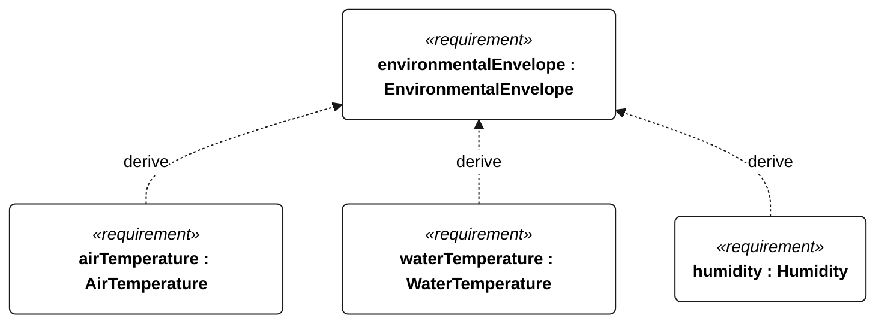
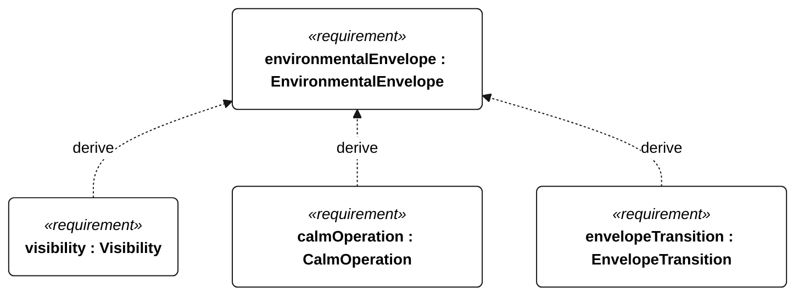

# N-001 EnvironmentalEnvelope relationships

<!-- Generated from SysML by scripts/render_requirements.py; edit the model, not this file. -->

[All requirement views](<../requirements-views.md>)

[Conditions, rationale and verification](<../requirements-context.md>)

**N-001 EnvironmentalEnvelope** — The vessel shall retain the functions required by its selected environmental profile and operating mode.

**N-030 AirTemperature** — The vessel shall retain mode-appropriate functions at ambient air temperatures from 0 to 40 degC.

**N-031 WaterTemperature** — Immersed hull, appendages and equipment shall retain mode-appropriate functions in water from 2 to 30 degC.

**N-032 Humidity** — Installed equipment shall retain operational functions at 0–100 percent relative humidity, including condensation.

**N-033 Visibility** — The vessel shall provide mode-appropriate navigation and traffic response across the specified visibility conditions.

**N-034 CalmOperation** — With harvesting disabled and mean wind below 3 m/s, the vessel shall retain calm-mode functions above the R-002 reserve for 24 continuous hours.

**N-035 EnvelopeTransition** — The vessel shall select survival or sailing operation according to the defined environmental transition conditions.

## N-001 relationships 1

## N-001 relationships 2

## Design decisions motivated by this requirement

Plain dependencies record design basis, not derivation or refinement. The native GeneralView renderer does not draw these dependencies; their actual endpoints and rationale are reported here.

| Dependent requirement | Design basis | Rationale |
| --- | --- | --- |
| marineDurability | environmentalEnvelope | MarineDurability supports environmentalEnvelope. This is design motivation or an implementation choice, not a satisfaction implication. |
| stabilityAndFouling | environmentalEnvelope | StabilityAndFouling supports environmentalEnvelope. This is design motivation or an implementation choice, not a satisfaction implication. |

[Continue: N-033 Visibility](<requirements-n-033.md>)

[Continue: N-035 EnvelopeTransition](<requirements-n-035.md>)

[Continue: N-003 StabilityAndFouling](<requirements-n-003.md>)

[Continue: N-002 MarineDurability](<requirements-n-002.md>)
