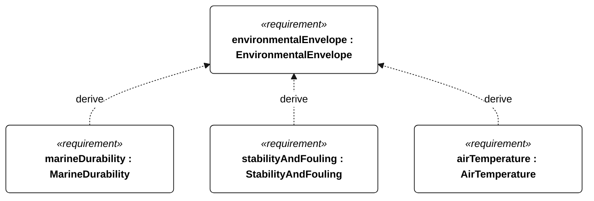
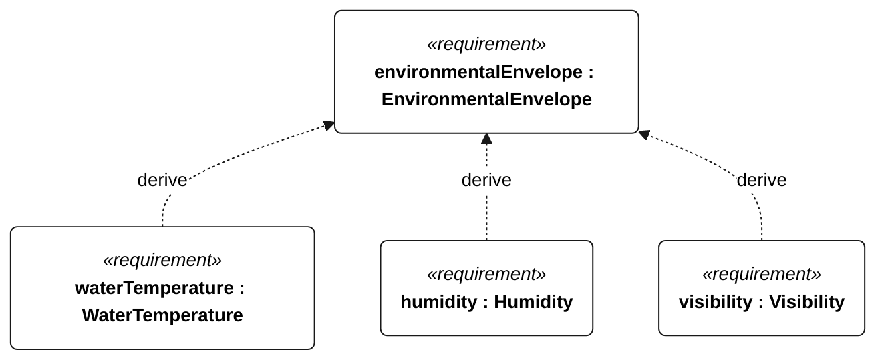
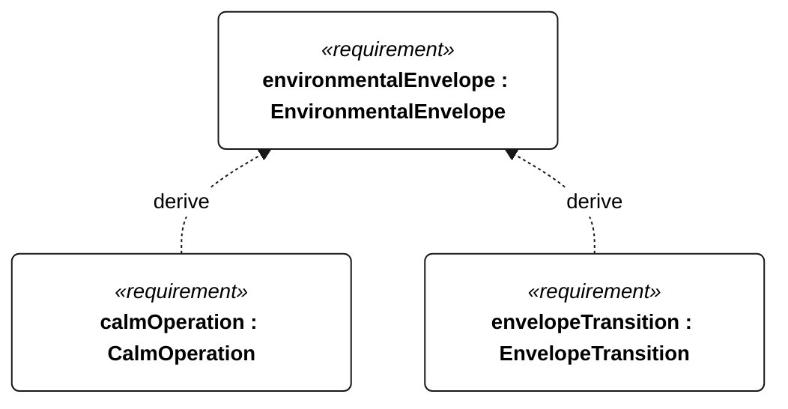

# N-001 environmental envelope

[All requirement views](<../requirements-views.md>)

**EnvironmentalEnvelope** — The vessel shall retain the common environmental capabilities specified by the shared exposure requirements in both mission environments, with distinct operational and survival outcomes. Gorge acceptance uses N-010 and its profile leaves; ocean acceptance uses N-020 and its profile leaves. These mission-specific profiles are not interchangeable, and a Gorge release does not require ocean qualification. Qualification shall exercise navigation, sail/steering control, recording and available-link telemetry concurrently; survival acceptance permits loss of course progress but requires flotation, attached rig/ballast, dry electronics and retained mission state. Passing the Gorge profile alone shall not establish ocean capability.

**MarineDurability** — The vessel shall retain its required functions and structural integrity during repeated freshwater Gorge service and prolonged saltwater ocean exposure. Qualification uses N-041 freshwater for the Gorge profile and N-042 saltwater for the ocean profile; dual-profile qualification requires both campaigns. Shared sealing, material aging and thermal checks use that selected campaign. Acceptance shall include post-exposure functional checks for the selected profile. Derivation edges indicate reasoning, not unconditional applicability of every descendant to every mission.

**StabilityAndFouling** — The vessel shall autonomously recover from capsize and tolerate submerged aquatic vegetation, including milfoil-like stems, without reliance on operator intervention during a qualifying attempt. Derived requirements specify righting, control recovery, weed passage, snag shedding and blockage response. Dense floating mats and fishing-line entanglement are not covered by the submerged-weed passage qualification.

**AirTemperature** — The vessel shall retain operational functions from 0 to 40 degC ambient air temperature. Qualification shall include powered cold and hot endpoints with internal temperatures stabilized to less than 1 degC change per hour, followed by 2 hours of operation at each endpoint. The same temperature range applies during survival, with only the mode-appropriate retained functions required by N-001/N-035.

**WaterTemperature** — The immersed hull, appendages and installed equipment shall retain operational functions in water from 2 to 30 degC, including 2 hours at each endpoint after thermal stabilization. The same temperature range applies during survival, with only the mode-appropriate retained functions required by N-001/N-035.

**Humidity** — The installed equipment shall retain operational functions at 0-100 percent relative humidity, including condensation. Qualification shall include three powered 24-hour cycles between 10 and 40 degC at at least 95 percent relative humidity, with visible condensation on external surfaces during cooling and no liquid water reaching enclosed electronics.

**Visibility** — Aggregate requirement for Visibility. Acceptance requires all applicable derived leaf results (N-101, N-102, N-103, N-104, N-105); this parent has no independent executable pass/fail predicate. Shared verification context: Exercise daylight and darkness at meteorological visibility of at least 1 km, and detected visibility below 1 km. Traffic performance remains subject to unresolved S-001 scenarios.

**CalmOperation** — With harvesting disabled, the vessel shall retain navigation, recording and autonomous boundary/traffic contingency functions for 24 continuous hours in mean wind below 3 m/s, without drawing conservative usable energy below the R-002 reserve. Initial conservative usable energy shall cover the reserve plus 24 hours of the measured worst-case electrical load for those calm-mode functions. Acceptance shall record the initial energy, load measurement and full energy history. Neither progress nor station keeping is required; R-004 prohibits automatic motor activation in a qualifying attempt.

**EnvelopeTransition** — Aggregate requirement for EnvelopeTransition. Acceptance requires all applicable derived leaf results (N-106, N-107, N-108, N-109, N-110, E-130, R-101); this parent has no independent executable pass/fail predicate. Shared verification context: The trigger is a detected upper operational wind or wave limit exceedance for the selected profile; calm invokes N-034. Resumption eligibility requires 10 continuous minutes inside the selected wind/wave limits, valid navigation and no low-energy, emergency-recovery or isolation restriction.

## N-001 derivation 1

## N-001 derivation 2

## N-001 derivation 3

[Continue: N-002 marine durability](<requirements-n-002.md>)

[Continue: N-003 stability and fouling](<requirements-n-003.md>)

[Continue: N-033 visibility](<requirements-n-033.md>)

[Continue: N-035 envelope transition](<requirements-n-035.md>)
