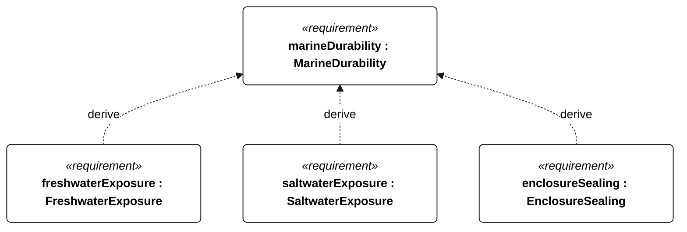
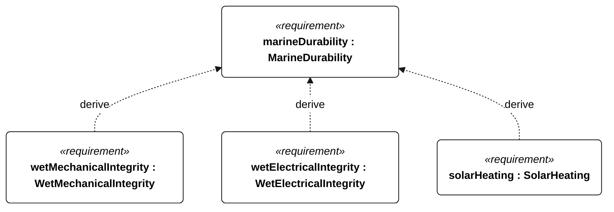
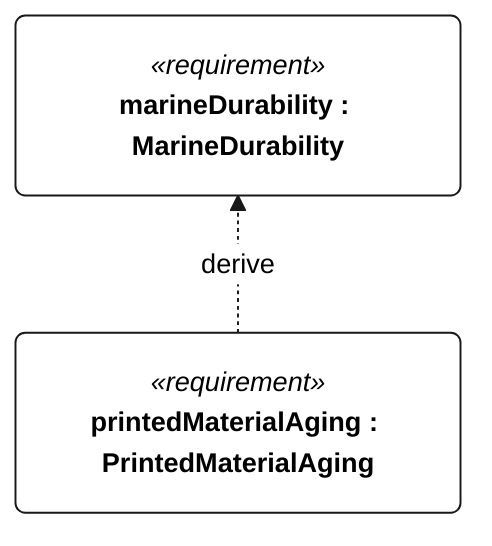

# N-002 marine durability

[All requirement views](<../requirements-views.md>)

**MarineDurability** — The vessel shall retain its required functions and structural integrity during repeated freshwater Gorge service and prolonged saltwater ocean exposure. Qualification uses N-041 freshwater for the Gorge profile and N-042 saltwater for the ocean profile; dual-profile qualification requires both campaigns. Shared sealing, material aging and thermal checks use that selected campaign. Acceptance shall include post-exposure functional checks for the selected profile. Derivation edges indicate reasoning, not unconditional applicability of every descendant to every mission.

**FreshwaterExposure** — For Gorge qualification, following 72 hours continuous freshwater exposure, with submerged parts continuously wet and complete topside spray wetting at least once per hour, the vessel shall pass its Gorge functional checks without repair or servicing.

**SaltwaterExposure** — For ocean qualification, following 30 days continuous 35 g/kg saltwater exposure, with submerged parts continuously wet and complete topside spray wetting at least once per hour, the vessel shall pass its ocean functional checks without repair or servicing. This campaign is an exposure qualification, not proof of the eventual passage duration.

**EnclosureSealing** — Before and after each wet-exposure campaign, installed electronics enclosures, connectors and penetrations shall show no detectable liquid ingress on dry internal water-sensitive indicators after 30 minutes immersion with their highest point 1 m below the water surface.

**WetMechanicalIntegrity** — Aggregate requirement for WetMechanicalIntegrity. Acceptance requires all applicable derived leaf results (N-111, N-112); this parent has no independent executable pass/fail predicate. Shared verification context: Evaluate after each selected profile wet-exposure campaign under N-002.

**WetElectricalIntegrity** — Aggregate requirement for WetElectricalIntegrity. Acceptance requires all applicable derived leaf results (N-113, N-114); this parent has no independent executable pass/fail predicate. Shared verification context: Evaluate disconnected cable assemblies after each selected profile wet-exposure campaign under N-002; disconnect electronics for insulation measurement.

**SolarHeating** — Aggregate requirement for SolarHeating. Acceptance requires all applicable derived leaf results (N-115, N-116, N-117); this parent has no independent executable pass/fail predicate. Shared verification context: Expose the powered vessel to 40 degC ambient air and 1000 W/m2 incident solar irradiance for 8 hours; use the installed battery manufacturer temperature limits.

**PrintedMaterialAging** — Printed structural material shall retain at least 80 percent of unaged failure load after 300 MJ/m2 cumulative UV exposure in the 300-400 nm band followed by the selected profile wet-exposure campaign (N-041 for Gorge; N-042 for ocean). Dual-profile qualification shall evaluate both aging/exposure sequences. Acceptance shall compare the lowest failure load of five aged coupons with the lowest of five unaged coupons of identical geometry, material, print orientation and process under the same loading fixture and rate.

## N-002 derivation 1

## N-002 derivation 2

## N-002 derivation 3

[Continue: N-044 wet mechanical integrity](<requirements-n-044.md>)

[Continue: N-045 wet electrical integrity](<requirements-n-045.md>)

[Continue: N-046 solar heating](<requirements-n-046.md>)
