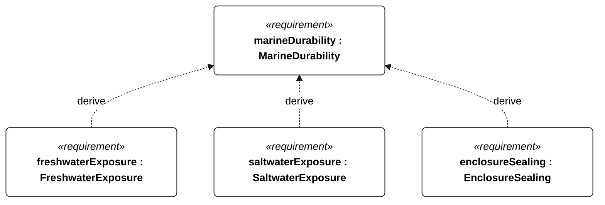
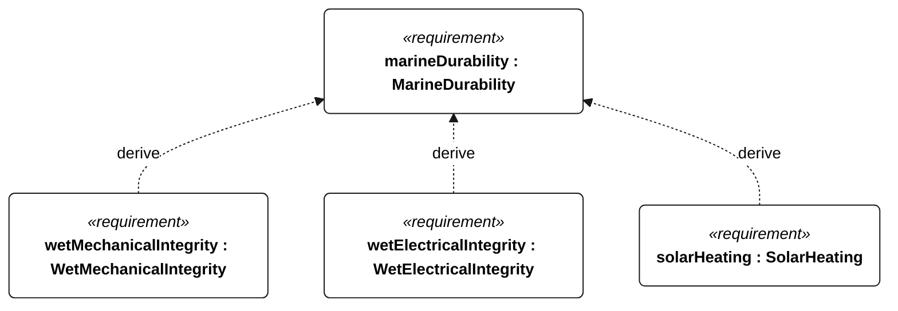
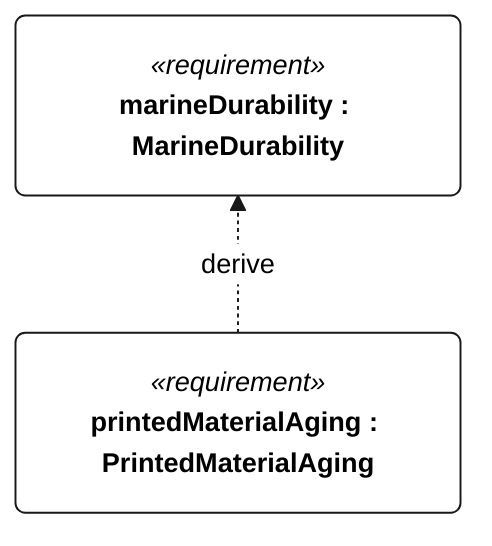

# N-002 MarineDurability relationships

<!-- Generated from SysML by scripts/render_requirements.py; edit the model, not this file. -->

[All requirement views](<../requirements-views.md>)

[Conditions, rationale and verification](<../requirements-context.md>)

**N-002 MarineDurability** — The vessel shall retain required function and structural integrity through its selected wet-exposure campaign.

**N-041 FreshwaterExposure** — For Gorge qualification, following 72 hours continuous freshwater exposure, with submerged parts continuously wet and complete topside spray wetting at least once per hour, the vessel shall pass its Gorge functional checks without repair or servicing.

**N-042 SaltwaterExposure** — For ocean qualification, following 30 days continuous 35 g/kg saltwater exposure, with submerged parts continuously wet and complete topside spray wetting at least once per hour, the vessel shall pass its ocean functional checks without repair or servicing.

**N-043 EnclosureSealing** — Before and after each wet-exposure campaign, installed electronics enclosures, connectors and penetrations shall show no detectable liquid ingress on dry internal water-sensitive indicators after 30 minutes immersion with their highest point 1 m below the water surface.

**N-044 WetMechanicalIntegrity** — External mechanisms and structural joints shall retain integrity after the selected wet-exposure campaign.

**N-045 WetElectricalIntegrity** — Cable assemblies shall retain electrical integrity after the selected wet-exposure campaign.

**N-046 SolarHeating** — The vessel shall retain safe powered operation during the specified solar-heating exposure.

**N-047 PrintedMaterialAging** — Printed structural material shall retain at least 80 percent of unaged failure load after the specified UV and wet-exposure sequence.

## N-002 relationships 1

## N-002 relationships 2

## N-002 relationships 3

[Continue: N-044 WetMechanicalIntegrity](<requirements-n-044.md>)

[Continue: N-045 WetElectricalIntegrity](<requirements-n-045.md>)

[Continue: N-046 SolarHeating](<requirements-n-046.md>)
