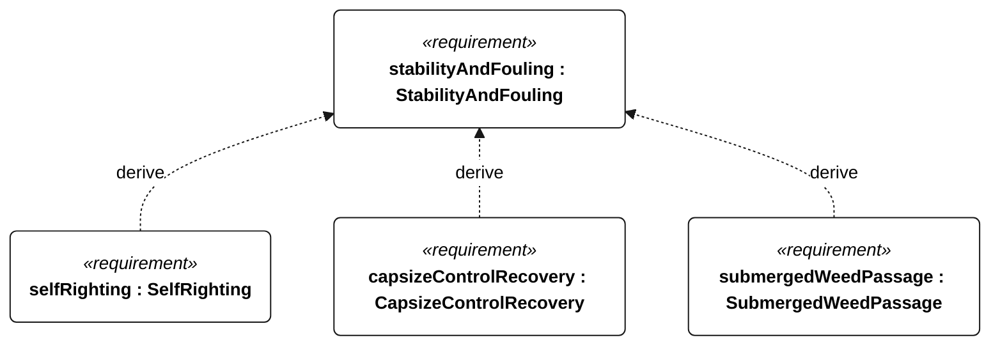
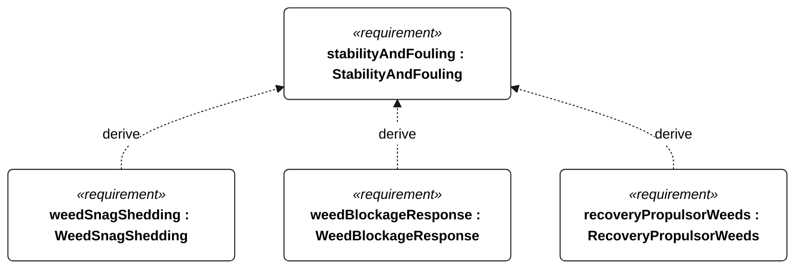

# N-003 stability and fouling

[All requirement views](<../requirements-views.md>)

**StabilityAndFouling** — The vessel shall autonomously recover from capsize and tolerate submerged aquatic vegetation, including milfoil-like stems, without reliance on operator intervention during a qualifying attempt. Derived requirements specify righting, control recovery, weed passage, snag shedding and blockage response. Dense floating mats and fishing-line entanglement are not covered by the submerged-weed passage qualification.

**SelfRighting** — Aggregate requirement for SelfRighting. Acceptance requires all applicable derived leaf results (N-118, N-119, N-120, N-121); this parent has no independent executable pass/fail predicate. Shared verification context: Use minimum and maximum mission loading, five releases at each angle of 90 and 180 degrees toward each side, without external action or motor thrust. Use freshwater for Gorge or 35 g/kg saltwater for ocean; dual qualification requires both media. All leaves apply to every release.

**CapsizeControlRecovery** — Aggregate requirement for CapsizeControlRecovery. Acceptance requires all applicable derived leaf results (N-122, N-123, N-124, N-125); this parent has no independent executable pass/fail predicate. Shared verification context: Apply to every N-051 release without operator input. Mode-appropriate control does not mean normal sailing before the N-035 resumption gate permits it.

**SubmergedWeedPassage** — Aggregate requirement for SubmergedWeedPassage. Acceptance requires all applicable derived leaf results (N-126, N-127); this parent has no independent executable pass/fail predicate. Shared verification context: Gorge campaign: five consecutive sailing passes without manual clearing or motor use through a 5 m by 1 m patch of 20 flexible branched stems per square metre, each 0.5-1.0 m long, extending from below the deepest appendage to within 0.1 m of the surface. Use 5 m/s mean wind and the weed-free reference heading. Record material, branch geometry, wet bending stiffness and anchoring; equivalence to local milfoil remains a physical-test validation task.

**WeedSnagShedding** — Aggregate requirement for WeedSnagShedding. Acceptance requires all applicable derived leaf results (N-128, N-129); this parent has no independent executable pass/fail predicate. Shared verification context: Gorge campaign: drape one wet 1 m branched stem over one appendage leading edge at a time, five repetitions per appendage, with N-053 surrogate characteristics, 5 m/s mean wind and the unobstructed reference heading. No manual assistance or motor use. Both leaf criteria apply to every repetition; visible stem removal alone is insufficient.

**WeedBlockageResponse** — Aggregate requirement for WeedBlockageResponse. Acceptance requires all applicable derived leaf results (N-130, N-131, N-132, R-101); this parent has no independent executable pass/fail predicate. Shared verification context: Gorge trigger: vegetation prevents completion of commanded rudder motion for 5 seconds, or keeps water-relative speed below 25 percent of the preceding weed-free 60-second mean for 60 seconds with mean wind at least 3 m/s. Dense mats are a blockage/avoidance case, not a pass-through claim.

**RecoveryPropulsorWeeds** — Aggregate requirement for RecoveryPropulsorWeeds. Acceptance requires all applicable derived leaf results (N-133, N-134, N-135, N-136, R-101); this parent has no independent executable pass/fail predicate. Shared verification context: Use a separately designated Gorge powered-recovery test with five passes through the N-053 patch without manual propulsor clearing, on the weed-free powered reference heading. Exercise locked propulsor separately.

## N-003 derivation 1

## N-003 derivation 2

[Continue: N-051 self righting](<requirements-n-051.md>)

[Continue: N-052 capsize control recovery](<requirements-n-052.md>)

[Continue: N-053 submerged weed passage](<requirements-n-053.md>)

[Continue: N-054 weed snag shedding](<requirements-n-054.md>)

[Continue: N-055 weed blockage response](<requirements-n-055.md>)

[Continue: N-056 recovery propulsor weeds](<requirements-n-056.md>)
