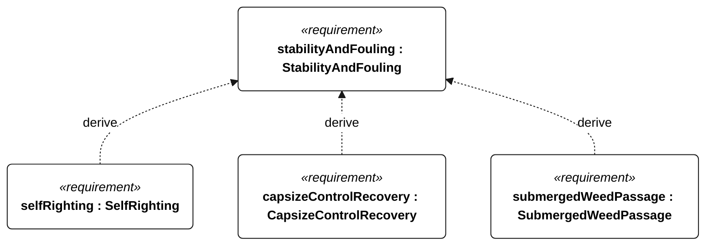
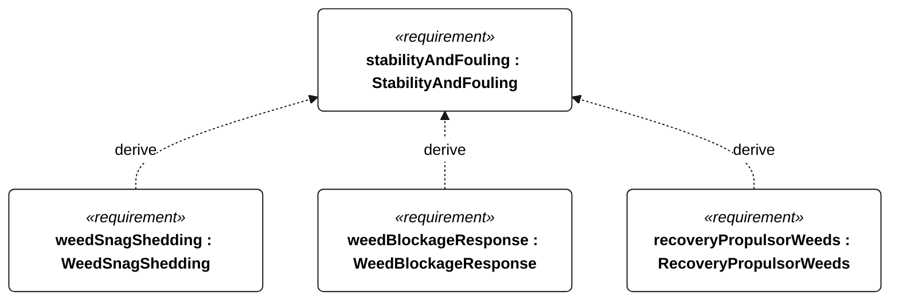

# N-003 StabilityAndFouling relationships

<!-- Generated from SysML by scripts/render_requirements.py; edit the model, not this file. -->

[All requirement views](<../requirements-views.md>)

[Conditions, rationale and verification](<../requirements-context.md>)

**N-003 StabilityAndFouling** — The vessel shall autonomously tolerate capsize and submerged aquatic vegetation, including milfoil-like stems.

**N-051 SelfRighting** — The vessel shall recover from the specified capsize releases without external assistance or motor thrust.

**N-052 CapsizeControlRecovery** — The vessel shall restore mode-appropriate control after each specified capsize release.

**N-053 SubmergedWeedPassage** — The vessel shall tolerate submerged milfoil-like vegetation during the specified unassisted Gorge sailing passes.

**N-054 WeedSnagShedding** — The vessel shall recover sailing performance after the specified appendage weed snags without assistance or motor use.

**N-055 WeedBlockageResponse** — The vessel shall enter autonomous fouling contingency when the defined weed-blockage trigger occurs.

**N-056 RecoveryPropulsorWeeds** — The recovery propulsion system shall tolerate the specified weed encounters within its rated electrical and thermal limits.

## N-003 relationships 1

## N-003 relationships 2

[Continue: N-051 SelfRighting](<requirements-n-051.md>)

[Continue: N-052 CapsizeControlRecovery](<requirements-n-052.md>)

[Continue: N-053 SubmergedWeedPassage](<requirements-n-053.md>)

[Continue: N-054 WeedSnagShedding](<requirements-n-054.md>)

[Continue: N-055 WeedBlockageResponse](<requirements-n-055.md>)

[Continue: N-056 RecoveryPropulsorWeeds](<requirements-n-056.md>)
