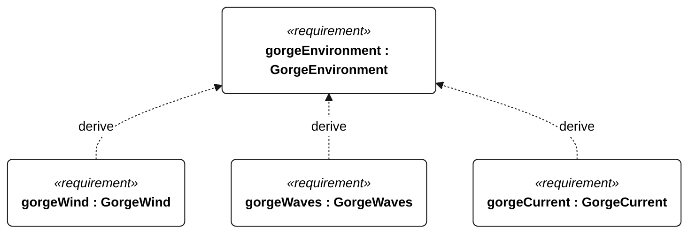
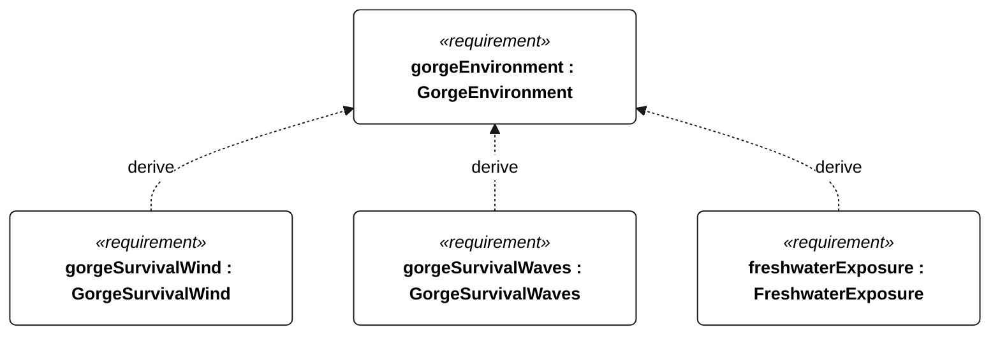
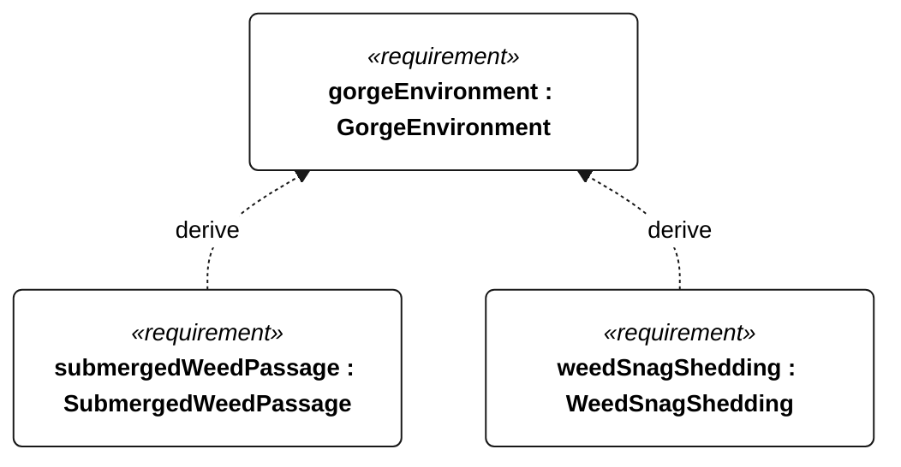

# N-010 gorge environment

[All requirement views](<../requirements-views.md>)

[Qualification conditions, rationale, open issues and verification](<../requirements-context.md>)

**N-010 GorgeEnvironment** — The vessel shall operate in the freshwater Columbia River reach between The Dalles and Bonneville, including opposing wind/current, short chop, traffic and submerged vegetation.

**N-011 GorgeWind** — The vessel shall retain operational functions in 3–15 m/s mean true wind with 3-second gusts up to 20 m/s.

**N-012 GorgeWaves** — The vessel shall retain operational functions in significant wave heights up to 1 m, peak periods 2–5 s and individual waves up to 2 m.

**N-013 GorgeCurrent** — The vessel shall retain navigation and control in currents from 0 to 1.5 m/s from any direction relative to wind and waves.

**N-014 GorgeSurvivalWind** — The vessel shall retain survival functions for 24 continuous hours in mean wind up to 25 m/s and 3-second gusts up to 35 m/s.

**N-015 GorgeSurvivalWaves** — The vessel shall retain survival functions for 24 continuous hours in significant wave heights up to 2 m, peak periods 3–7 s and individual waves up to 4 m.

**N-041 FreshwaterExposure** — For Gorge qualification, following 72 hours continuous freshwater exposure, with submerged parts continuously wet and complete topside spray wetting at least once per hour, the vessel shall pass its Gorge functional checks without repair or servicing.

**N-053 SubmergedWeedPassage** — The vessel shall tolerate submerged milfoil-like vegetation during the specified unassisted Gorge sailing passes.

**N-054 WeedSnagShedding** — The vessel shall recover sailing performance after the specified appendage weed snags without assistance or motor use.

## N-010 derivation 1

## N-010 derivation 2

## N-010 derivation 3

[Continue: N-053 submerged weed passage](<requirements-n-053.md>)

[Continue: N-054 weed snag shedding](<requirements-n-054.md>)
