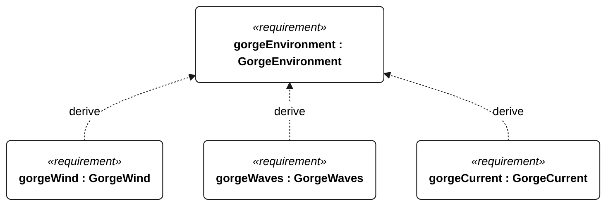
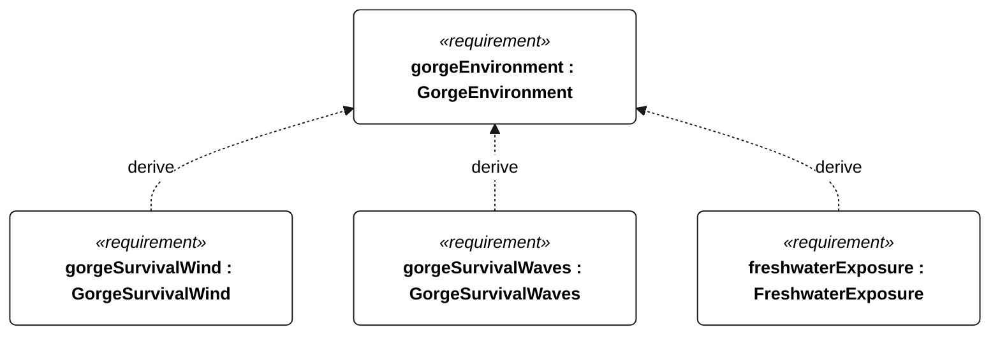
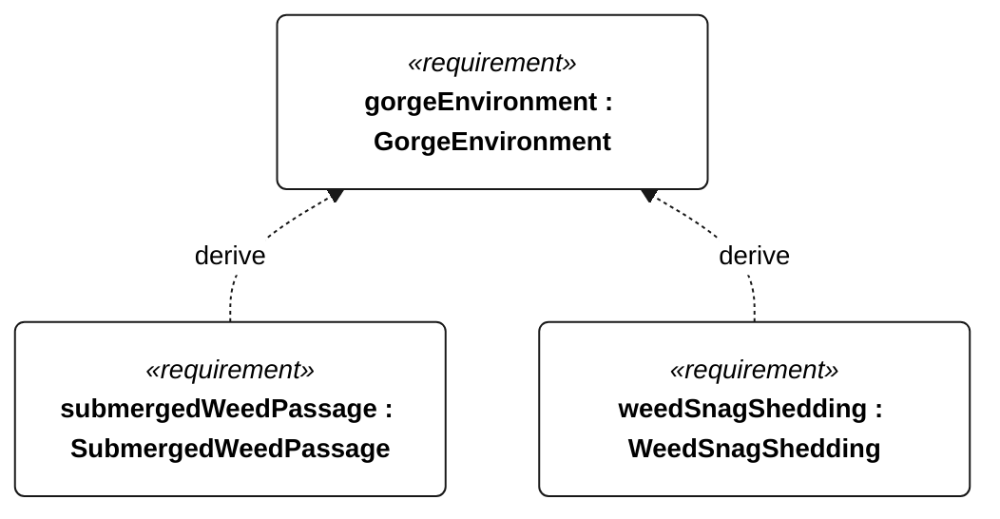

# N-010 gorge environment

[All requirement views](<../requirements-views.md>)

**GorgeEnvironment** — The vessel shall operate on the Columbia River reach between The Dalles and Bonneville in freshwater, opposing wind/current, short-period chop, traffic and submerged aquatic vegetation. Gorge-derived parameter requirements and the shared exposure requirements apply together; no dam transit, ice or surf-zone launch is included.

**GorgeWind** — The vessel shall retain the N-001 operational functions in true wind from 3 to 15 m/s (10-minute mean referenced to 10 m above water), including 3-second gusts up to 20 m/s. Qualification shall include upwind, crosswind and downwind headings; this is a functional wind limit, not a guarantee of upstream progress.

**GorgeWaves** — The vessel shall retain N-001 operational functions in significant wave heights up to 1 m with peak periods 2-5 s, including individual waves up to 2 m. Wave statistics shall use 20-minute records. Qualification shall include head, beam and following seas and physically realizable wind-wave-current combinations within the profile.

**GorgeCurrent** — The vessel shall retain navigation and control in currents from 0 to 1.5 m/s from any direction relative to wind and waves. Qualification shall include opposing current. Predicted boundary risk shall invoke S-002; current tolerance alone does not ensure progress or station keeping. Positive upstream speed is not required at every wind speed or heading.

**GorgeSurvivalWind** — For 24 continuous hours, the vessel shall meet the N-001 survival acceptance outcomes in mean wind up to 25 m/s and 3-second gusts up to 35 m/s, using the operational wind reference convention. The respective wave, current, temperature and humidity limits apply concurrently.

**GorgeSurvivalWaves** — For 24 continuous hours, the vessel shall meet the N-001 survival acceptance outcomes in significant wave heights up to 2 m, peak periods 3-7 s and individual waves up to 4 m. Qualification shall include adverse relative directions and physically realizable combinations with profile survival wind and current.

**FreshwaterExposure** — For Gorge qualification, following 72 hours continuous freshwater exposure, with submerged parts continuously wet and complete topside spray wetting at least once per hour, the vessel shall pass its Gorge functional checks without repair or servicing.

**SubmergedWeedPassage** — Aggregate requirement for SubmergedWeedPassage. Acceptance requires all applicable derived leaf results (N-126, N-127); this parent has no independent executable pass/fail predicate. Shared verification context: Gorge campaign: five consecutive sailing passes without manual clearing or motor use through a 5 m by 1 m patch of 20 flexible branched stems per square metre, each 0.5-1.0 m long, extending from below the deepest appendage to within 0.1 m of the surface. Use 5 m/s mean wind and the weed-free reference heading. Record material, branch geometry, wet bending stiffness and anchoring; equivalence to local milfoil remains a physical-test validation task.

**WeedSnagShedding** — Aggregate requirement for WeedSnagShedding. Acceptance requires all applicable derived leaf results (N-128, N-129); this parent has no independent executable pass/fail predicate. Shared verification context: Gorge campaign: drape one wet 1 m branched stem over one appendage leading edge at a time, five repetitions per appendage, with N-053 surrogate characteristics, 5 m/s mean wind and the unobstructed reference heading. No manual assistance or motor use. Both leaf criteria apply to every repetition; visible stem removal alone is insufficient.

## N-010 derivation 1

## N-010 derivation 2

## N-010 derivation 3

[Continue: N-053 submerged weed passage](<requirements-n-053.md>)

[Continue: N-054 weed snag shedding](<requirements-n-054.md>)
