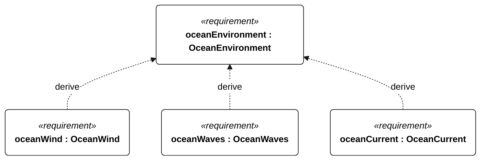
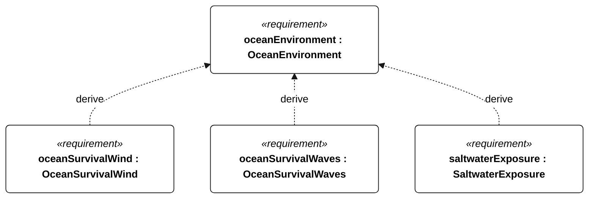

# N-020 ocean environment

[All requirement views](<../requirements-views.md>)

**OceanEnvironment** — The vessel shall operate on a northeast Pacific passage toward Hawaii in saltwater, ocean swell, wind seas and prolonged unattended exposure. Ocean-derived parameter requirements and the shared exposure requirements apply together. The baseline is not a hurricane-survival claim or a completed route/season qualification.

**OceanWind** — The vessel shall retain the N-001 operational functions in true wind from 3 to 15 m/s (10-minute mean referenced to 10 m above water), including 3-second gusts up to 20 m/s. Qualification shall include upwind, crosswind and downwind headings; this is a functional wind limit, not a guarantee of upstream progress.

**OceanWaves** — The vessel shall retain N-001 operational functions in significant wave heights up to 3 m with peak periods 5-20 s, including individual waves up to 6 m. Wave statistics shall use 20-minute records. Qualification shall include head, beam and following seas and physically realizable wind-wave-current combinations within the profile.

**OceanCurrent** — The vessel shall retain navigation and control in currents from 0 to 1.0 m/s from any direction relative to wind and waves. Qualification shall include opposing current. Predicted boundary risk shall invoke S-002; current tolerance alone does not ensure progress or station keeping. Positive upstream speed is not required at every wind speed or heading.

**OceanSurvivalWind** — For 24 continuous hours, the vessel shall meet the N-001 survival acceptance outcomes in mean wind up to 25 m/s and 3-second gusts up to 35 m/s, using the operational wind reference convention. The respective wave, current, temperature and humidity limits apply concurrently.

**OceanSurvivalWaves** — For 24 continuous hours, the vessel shall meet the N-001 survival acceptance outcomes in significant wave heights up to 6 m, peak periods 6-20 s and individual waves up to 12 m. Qualification shall include adverse relative directions and physically realizable combinations with profile survival wind and current.

**SaltwaterExposure** — For ocean qualification, following 30 days continuous 35 g/kg saltwater exposure, with submerged parts continuously wet and complete topside spray wetting at least once per hour, the vessel shall pass its ocean functional checks without repair or servicing. This campaign is an exposure qualification, not proof of the eventual passage duration.

## N-020 derivation 1

## N-020 derivation 2

