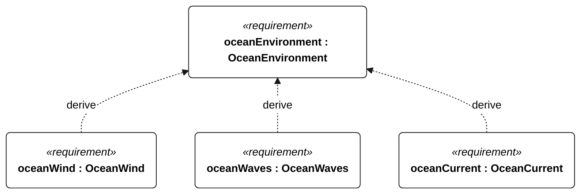
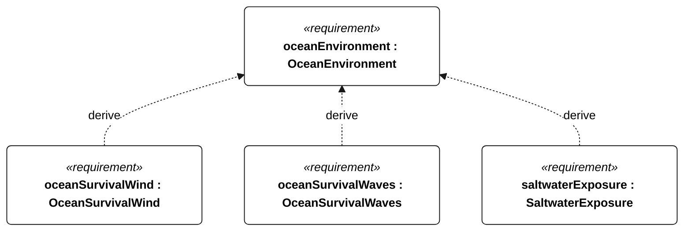

# N-020 OceanEnvironment relationships

<!-- Generated from SysML by scripts/render_requirements.py; edit the model, not this file. -->

[All requirement views](<../requirements-views.md>)

[Conditions, rationale and verification](<../requirements-context.md>)

**N-020 OceanEnvironment** — The vessel shall operate on a northeast Pacific passage toward Hawaii amid saltwater, ocean swell, wind seas and prolonged unattended exposure.

**N-021 OceanWind** — The vessel shall retain operational functions in 3–15 m/s mean true wind with 3-second gusts up to 20 m/s.

**N-022 OceanWaves** — The vessel shall retain operational functions in significant wave heights up to 3 m, peak periods 5–20 s and individual waves up to 6 m.

**N-023 OceanCurrent** — The vessel shall retain navigation and control in currents from 0 to 1.0 m/s from any direction relative to wind and waves.

**N-024 OceanSurvivalWind** — The vessel shall retain survival functions for 24 continuous hours in mean wind up to 25 m/s and 3-second gusts up to 35 m/s.

**N-025 OceanSurvivalWaves** — The vessel shall retain survival functions for 24 continuous hours in significant wave heights up to 6 m, peak periods 6–20 s and individual waves up to 12 m.

**N-042 SaltwaterExposure** — For ocean qualification, following 30 days continuous 35 g/kg saltwater exposure, with submerged parts continuously wet and complete topside spray wetting at least once per hour, the vessel shall pass its ocean functional checks without repair or servicing.

## N-020 relationships 1

## N-020 relationships 2

