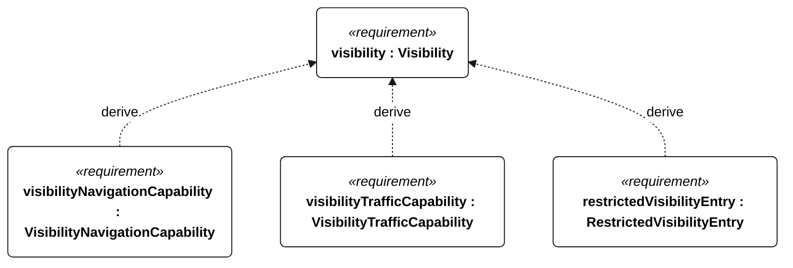
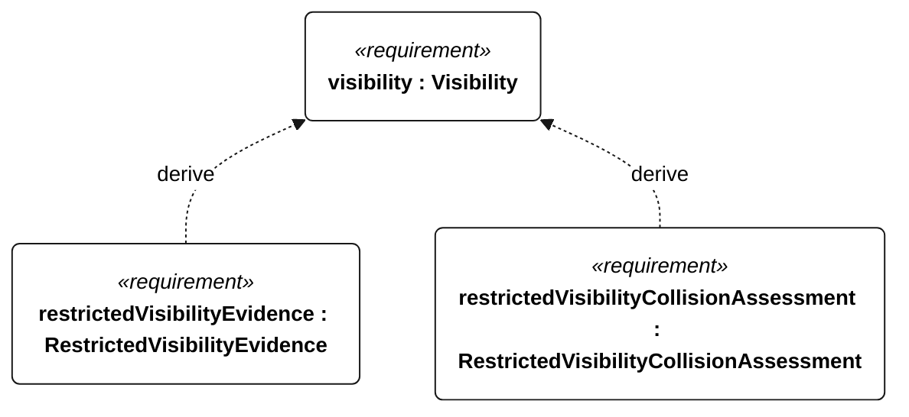

# N-033 visibility

[All requirement views](<../requirements-views.md>)

[Qualification conditions, rationale, open issues and verification](<../requirements-context.md>)

**N-033 Visibility** — The vessel shall provide mode-appropriate navigation and traffic response across the specified visibility conditions.

**N-101 VisibilityNavigationCapability** — Navigation shall meet E-002 and E-008 acceptance criteria at visibility of at least 1 km in daylight and darkness.

**N-102 VisibilityTrafficCapability** — Traffic assessment shall meet the frozen S-001 criteria at visibility of at least 1 km in daylight and darkness.

**N-103 RestrictedVisibilityEntry** — On detecting visibility below 1 km, the vessel shall enter restricted-visibility state within 60 seconds.

**N-104 RestrictedVisibilityEvidence** — Restricted-visibility operation shall be recorded as outside the normal operational envelope.

**N-105 RestrictedVisibilityCollisionAssessment** — Collision assessment shall remain active during restricted-visibility operation.

## N-033 derivation 1

## N-033 derivation 2

