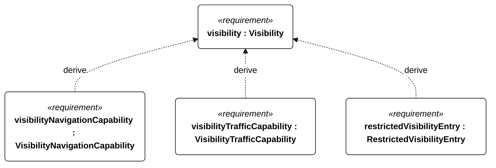
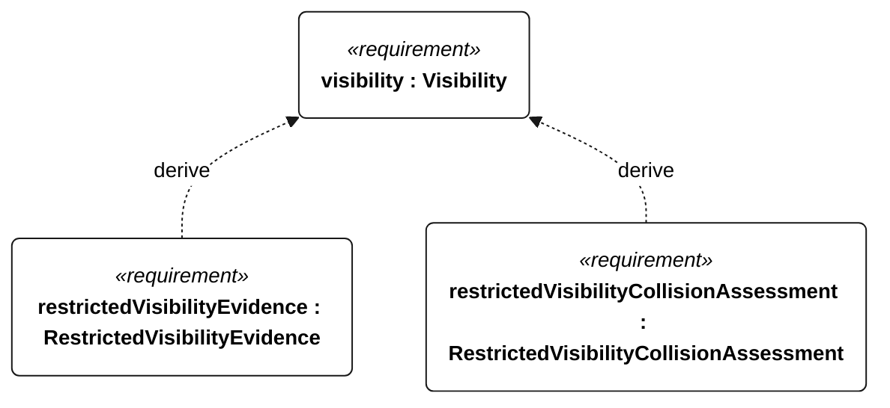

# N-033 visibility

[All requirement views](<../requirements-views.md>)

**Visibility** — Aggregate requirement for Visibility. Acceptance requires all applicable derived leaf results (N-101, N-102, N-103, N-104, N-105); this parent has no independent executable pass/fail predicate. Shared verification context: Exercise daylight and darkness at meteorological visibility of at least 1 km, and detected visibility below 1 km. Traffic performance remains subject to unresolved S-001 scenarios.

**VisibilityNavigationCapability** — Navigation shall meet E-002 and E-008 acceptance criteria at visibility of at least 1 km in daylight and darkness. Verification uses the shared context of N-033.

**VisibilityTrafficCapability** — Traffic assessment shall meet the frozen S-001 criteria at visibility of at least 1 km in daylight and darkness. Verification uses the shared context of N-033.

**RestrictedVisibilityEntry** — On detecting visibility below 1 km, the vessel shall enter restricted-visibility state within 60 seconds. Verification uses the shared context of N-033.

**RestrictedVisibilityEvidence** — Restricted-visibility operation shall be recorded as outside the normal operational envelope. Verification uses the shared context of N-033.

**RestrictedVisibilityCollisionAssessment** — Collision assessment shall remain active during restricted-visibility operation. Verification uses the shared context of N-033.

## N-033 derivation 1

## N-033 derivation 2

