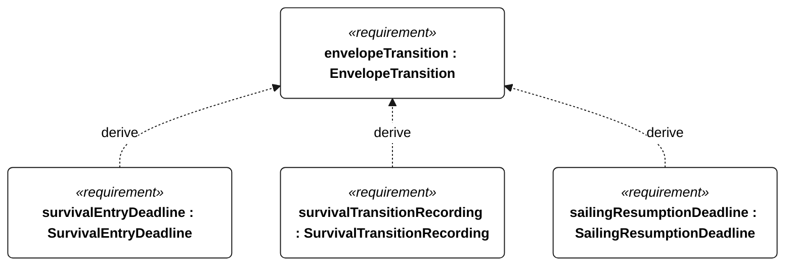
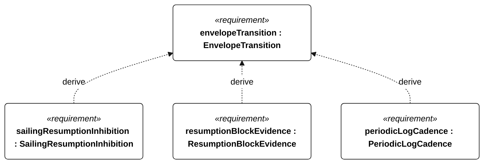
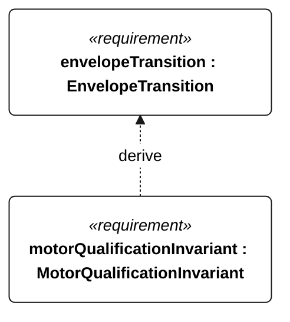

# N-035 EnvelopeTransition relationships

<!-- Generated from SysML by scripts/render_requirements.py; edit the model, not this file. -->

[All requirement views](<../requirements-views.md>)

[Conditions, rationale and verification](<../requirements-context.md>)

**N-035 EnvelopeTransition** — The vessel shall select survival or sailing operation according to the defined environmental transition conditions.

**N-106 SurvivalEntryDeadline** — The vessel shall enter survival mode within 60 seconds of the N-035 upper-limit trigger.

**N-107 SurvivalTransitionRecording** — Every survival-mode entry shall have a corresponding event record.

**N-108 SailingResumptionDeadline** — Full autonomous sailing shall resume within 5 minutes of N-035 resumption eligibility becoming continuously true.

**N-109 SailingResumptionInhibition** — Full autonomous sailing shall remain inhibited while N-035 resumption eligibility is false.

**N-110 ResumptionBlockEvidence** — Every blocked sailing-resumption attempt shall record the blocking condition.

**E-130 PeriodicLogCadence** — Periodic mission records shall be acquired at least once per second normally and once per minute in low-energy or survival operation.

**R-101 MotorQualificationInvariant** — Motor thrust shall remain disabled whenever an attempt is qualifying or qualification status is unknown.

## N-035 relationships 1

## N-035 relationships 2

## N-035 relationships 3

