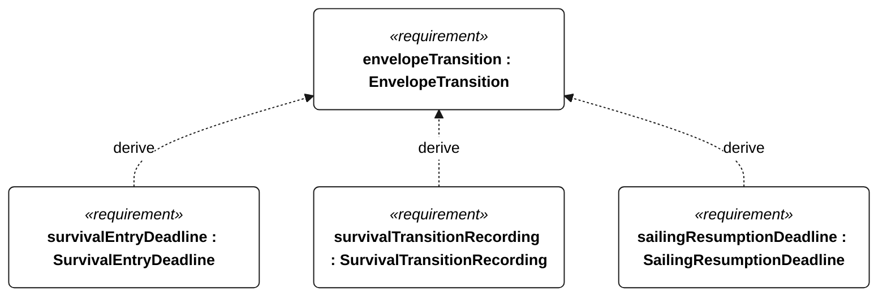
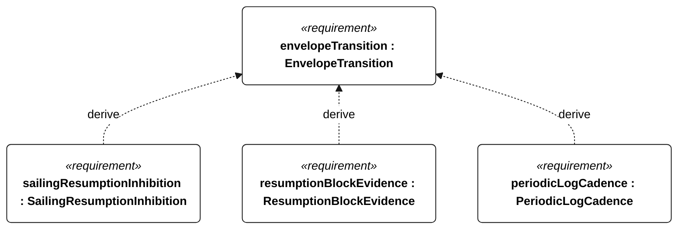
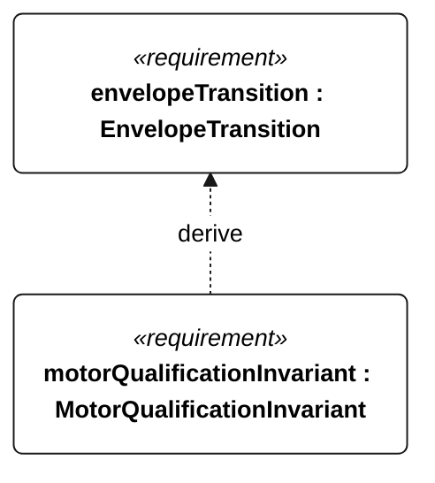

# N-035 envelope transition

[All requirement views](<../requirements-views.md>)

**EnvelopeTransition** — Aggregate requirement for EnvelopeTransition. Acceptance requires all applicable derived leaf results (N-106, N-107, N-108, N-109, N-110, E-130, R-101); this parent has no independent executable pass/fail predicate. Shared verification context: The trigger is a detected upper operational wind or wave limit exceedance for the selected profile; calm invokes N-034. Resumption eligibility requires 10 continuous minutes inside the selected wind/wave limits, valid navigation and no low-energy, emergency-recovery or isolation restriction.

**SurvivalEntryDeadline** — The vessel shall enter survival mode within 60 seconds of the N-035 upper-limit trigger. Verification uses the shared context of N-035.

**SurvivalTransitionRecording** — Every survival-mode entry shall have a corresponding event record. Verification uses the shared context of N-035.

**SailingResumptionDeadline** — Full autonomous sailing shall resume within 5 minutes of N-035 resumption eligibility becoming continuously true. Verification uses the shared context of N-035.

**SailingResumptionInhibition** — Full autonomous sailing shall remain inhibited while N-035 resumption eligibility is false. Verification uses the shared context of N-035.

**ResumptionBlockEvidence** — Every blocked sailing-resumption attempt shall record the blocking condition. Verification uses the shared context of N-035.

**PeriodicLogCadence** — Periodic mission records shall be acquired at least once per second normally and once per minute in low-energy or survival operation. Verification uses the shared context of E-007.

**MotorQualificationInvariant** — Motor thrust shall remain disabled whenever an attempt is qualifying or qualification status is unknown. Verification uses the shared context of R-004.

## N-035 derivation 1

## N-035 derivation 2

## N-035 derivation 3

