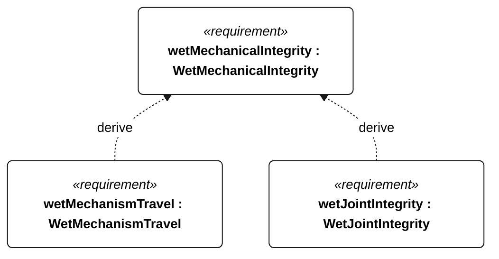

# N-044 wet mechanical integrity

[All requirement views](<../requirements-views.md>)

[Qualification conditions, rationale, open issues and verification](<../requirements-context.md>)

**N-044 WetMechanicalIntegrity** — External mechanisms and structural joints shall retain integrity after the selected wet-exposure campaign.

**N-111 WetMechanismTravel** — After each N-044 exposure, external mechanisms shall complete their full commanded travel without seizure.

**N-112 WetJointIntegrity** — After each N-044 exposure, structural joints shall show no separation or through-cracks on visual inspection at 5 times magnification.

## N-044 derivation 1

