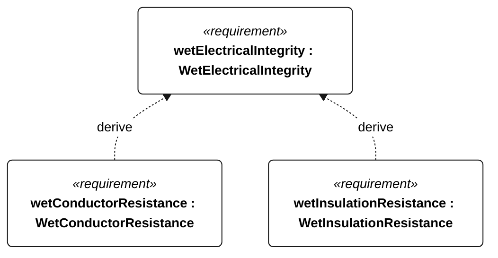

# N-045 WetElectricalIntegrity relationships

<!-- Generated from SysML by scripts/render_requirements.py; edit the model, not this file. -->

[All requirement views](<../requirements-views.md>)

[Conditions, rationale and verification](<../requirements-context.md>)

**N-045 WetElectricalIntegrity** — Cable assemblies shall retain electrical integrity after the selected wet-exposure campaign.

**N-113 WetConductorResistance** — After each N-045 exposure, end-to-end conductor resistance shall be no more than 10 percent above its pre-test value.

**N-114 WetInsulationResistance** — After each N-045 exposure, conductor-to-conductor and conductor-to-case insulation resistance shall be at least 1 megohm at 50 V DC.

## N-045 relationships 1

