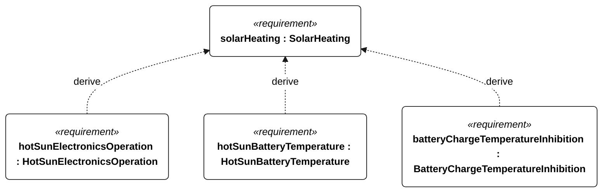

# N-046 solar heating

[All requirement views](<../requirements-views.md>)

[Qualification conditions, rationale, open issues and verification](<../requirements-context.md>)

**N-046 SolarHeating** — The vessel shall retain safe powered operation during the specified solar-heating exposure.

**N-115 HotSunElectronicsOperation** — Powered electronics shall retain operational functions throughout the N-046 exposure.

**N-116 HotSunBatteryTemperature** — Battery temperatures shall remain within manufacturer operating limits throughout the N-046 exposure.

**N-117 BatteryChargeTemperatureInhibition** — Battery charging shall remain inhibited whenever measured battery temperature is outside the manufacturer permitted charge range.

## N-046 derivation 1

