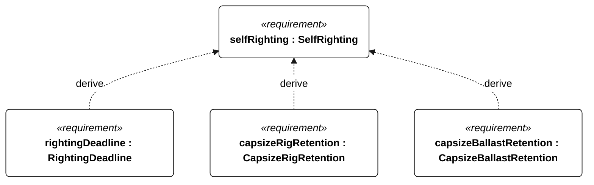
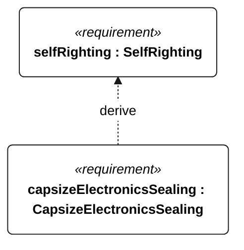

# N-051 self righting

[All requirement views](<../requirements-views.md>)

**SelfRighting** — Aggregate requirement for SelfRighting. Acceptance requires all applicable derived leaf results (N-118, N-119, N-120, N-121); this parent has no independent executable pass/fail predicate. Shared verification context: Use minimum and maximum mission loading, five releases at each angle of 90 and 180 degrees toward each side, without external action or motor thrust. Use freshwater for Gorge or 35 g/kg saltwater for ocean; dual qualification requires both media. All leaves apply to every release.

**RightingDeadline** — The vessel shall self-right within 60 seconds of each N-051 release. Verification uses the shared context of N-051.

**CapsizeRigRetention** — The vessel shall retain its rig through every N-051 release. Verification uses the shared context of N-051.

**CapsizeBallastRetention** — The vessel shall retain its ballast through every N-051 release. Verification uses the shared context of N-051.

**CapsizeElectronicsSealing** — No water shall reach electronics during any N-051 release. Verification uses the shared context of N-051.

## N-051 derivation 1

## N-051 derivation 2

