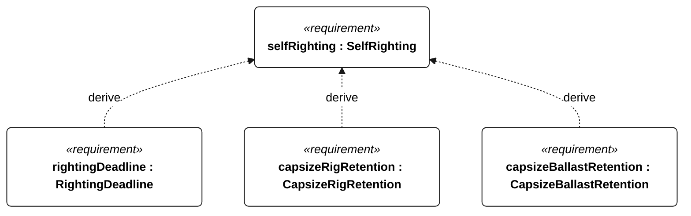
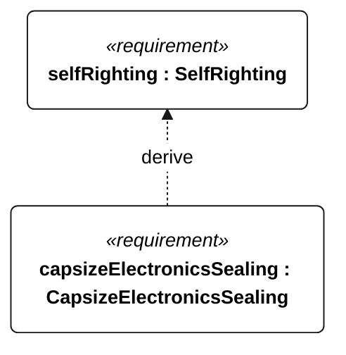

# N-051 self righting

<!-- Generated from SysML by scripts/render_requirements.py; edit the model, not this file. -->

[All requirement views](<../requirements-views.md>)

[Qualification conditions, rationale, open issues and verification](<../requirements-context.md>)

**N-051 SelfRighting** — The vessel shall recover from the specified capsize releases without external assistance or motor thrust.

**N-118 RightingDeadline** — The vessel shall self-right within 60 seconds of each N-051 release.

**N-119 CapsizeRigRetention** — The vessel shall retain its rig through every N-051 release.

**N-120 CapsizeBallastRetention** — The vessel shall retain its ballast through every N-051 release.

**N-121 CapsizeElectronicsSealing** — No water shall reach electronics during any N-051 release.

## N-051 derivation 1

## N-051 derivation 2

