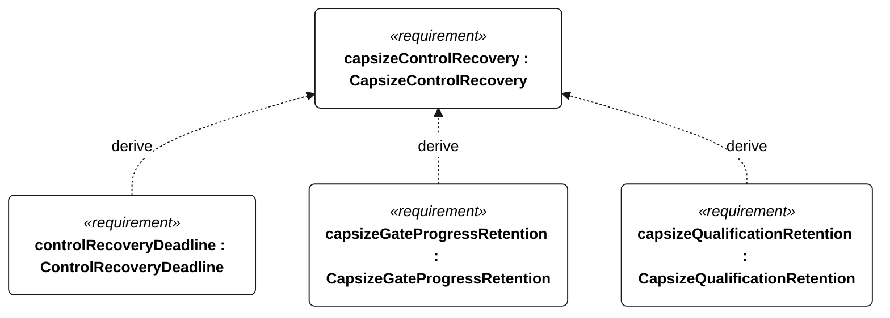
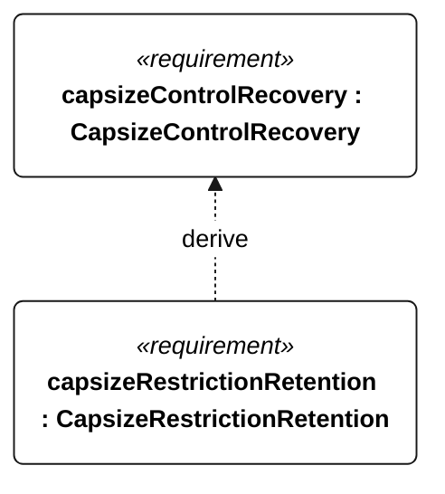

# N-052 capsize control recovery

[All requirement views](<../requirements-views.md>)

[Qualification conditions, rationale, open issues and verification](<../requirements-context.md>)

**N-052 CapsizeControlRecovery** — The vessel shall restore mode-appropriate control after each specified capsize release.

**N-122 ControlRecoveryDeadline** — The vessel shall restore mode-appropriate autonomous sail/steering control within 120 seconds from each N-051 release.

**N-123 CapsizeGateProgressRetention** — Gate progress shall be preserved through every N-051 release.

**N-124 CapsizeQualificationRetention** — Qualification status shall be preserved through every N-051 release absent an independently disqualifying event.

**N-125 CapsizeRestrictionRetention** — Control restoration after each N-051 release shall preserve every active survival, low-energy, recovery and motor-inhibition restriction.

## N-052 derivation 1

## N-052 derivation 2

