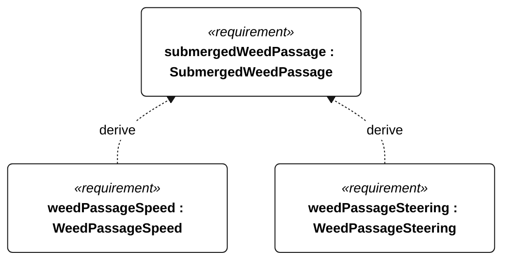

# N-053 submerged weed passage

[All requirement views](<../requirements-views.md>)

**SubmergedWeedPassage** — Aggregate requirement for SubmergedWeedPassage. Acceptance requires all applicable derived leaf results (N-126, N-127); this parent has no independent executable pass/fail predicate. Shared verification context: Gorge campaign: five consecutive sailing passes without manual clearing or motor use through a 5 m by 1 m patch of 20 flexible branched stems per square metre, each 0.5-1.0 m long, extending from below the deepest appendage to within 0.1 m of the surface. Use 5 m/s mean wind and the weed-free reference heading. Record material, branch geometry, wet bending stiffness and anchoring; equivalence to local milfoil remains a physical-test validation task.

**WeedPassageSpeed** — During each N-053 patch passage, mean water-relative sailing speed shall be at least 50 percent of the weed-free reference speed. Verification uses the shared context of N-053.

**WeedPassageSteering** — After each N-053 patch passage, full commanded rudder travel shall be regained within 5 minutes. Verification uses the shared context of N-053.

## N-053 derivation 1

