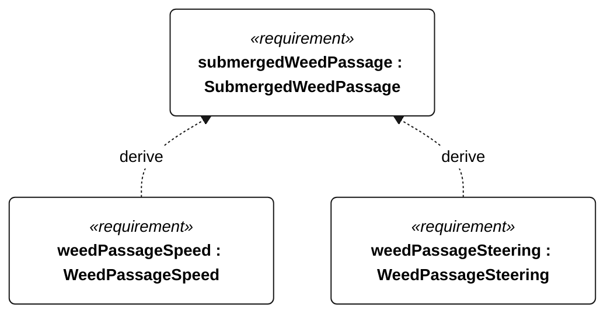

# N-053 submerged weed passage

[All requirement views](<../requirements-views.md>)

[Qualification conditions, rationale, open issues and verification](<../requirements-context.md>)

**N-053 SubmergedWeedPassage** — The vessel shall tolerate submerged milfoil-like vegetation during the specified unassisted Gorge sailing passes.

**N-126 WeedPassageSpeed** — During each N-053 patch passage, mean water-relative sailing speed shall be at least 50 percent of the weed-free reference speed.

**N-127 WeedPassageSteering** — After each N-053 patch passage, full commanded rudder travel shall be regained within 5 minutes.

## N-053 derivation 1

