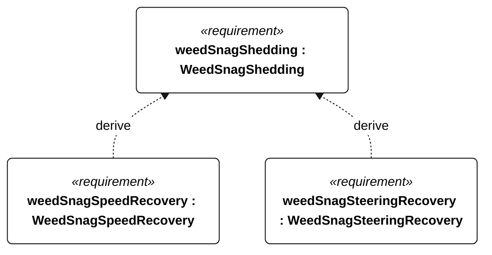

# N-054 weed snag shedding

[All requirement views](<../requirements-views.md>)

**WeedSnagShedding** — Aggregate requirement for WeedSnagShedding. Acceptance requires all applicable derived leaf results (N-128, N-129); this parent has no independent executable pass/fail predicate. Shared verification context: Gorge campaign: drape one wet 1 m branched stem over one appendage leading edge at a time, five repetitions per appendage, with N-053 surrogate characteristics, 5 m/s mean wind and the unobstructed reference heading. No manual assistance or motor use. Both leaf criteria apply to every repetition; visible stem removal alone is insufficient.

**WeedSnagSpeedRecovery** — Within 5 minutes of each N-054 snag, water-relative sailing speed shall recover to at least 50 percent of unobstructed reference speed. Verification uses the shared context of N-054.

**WeedSnagSteeringRecovery** — Within 5 minutes of each N-054 snag, full commanded rudder travel shall be regained. Verification uses the shared context of N-054.

## N-054 derivation 1

