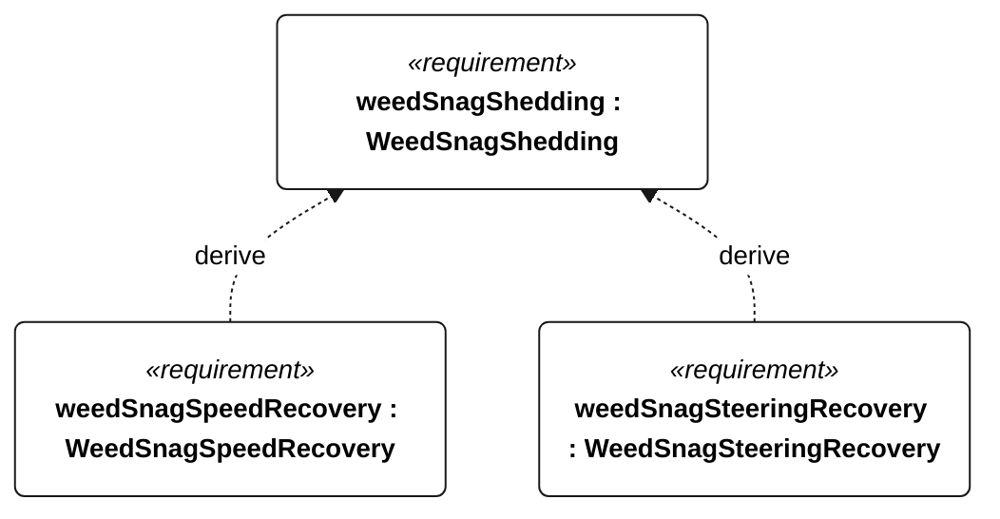

# N-054 weed snag shedding

<!-- Generated from SysML by scripts/render_requirements.py; edit the model, not this file. -->

[All requirement views](<../requirements-views.md>)

[Qualification conditions, rationale, open issues and verification](<../requirements-context.md>)

**N-054 WeedSnagShedding** — The vessel shall recover sailing performance after the specified appendage weed snags without assistance or motor use.

**N-128 WeedSnagSpeedRecovery** — Within 5 minutes of each N-054 snag, water-relative sailing speed shall recover to at least 50 percent of unobstructed reference speed.

**N-129 WeedSnagSteeringRecovery** — Within 5 minutes of each N-054 snag, full commanded rudder travel shall be regained.

## N-054 derivation 1

