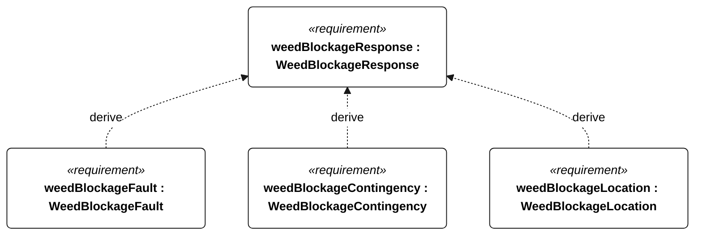
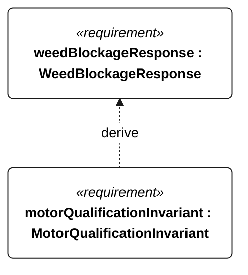

# N-055 weed blockage response

[All requirement views](<../requirements-views.md>)

**WeedBlockageResponse** — Aggregate requirement for WeedBlockageResponse. Acceptance requires all applicable derived leaf results (N-130, N-131, N-132, R-101); this parent has no independent executable pass/fail predicate. Shared verification context: Gorge trigger: vegetation prevents completion of commanded rudder motion for 5 seconds, or keeps water-relative speed below 25 percent of the preceding weed-free 60-second mean for 60 seconds with mean wind at least 3 m/s. Dense mats are a blockage/avoidance case, not a pass-through claim.

**WeedBlockageFault** — A suspected-fouling fault shall be logged within 10 seconds after the N-055 trigger. Verification uses the shared context of N-055.

**WeedBlockageContingency** — The vessel shall enter fouling-contingency state within 10 seconds after the N-055 trigger. Verification uses the shared context of N-055.

**WeedBlockageLocation** — Location reporting shall continue at the active telemetry cadence during fouling contingency whenever a link is available. Verification uses the shared context of N-055.

**MotorQualificationInvariant** — Motor thrust shall remain disabled whenever an attempt is qualifying or qualification status is unknown. Verification uses the shared context of R-004.

## N-055 derivation 1

## N-055 derivation 2

