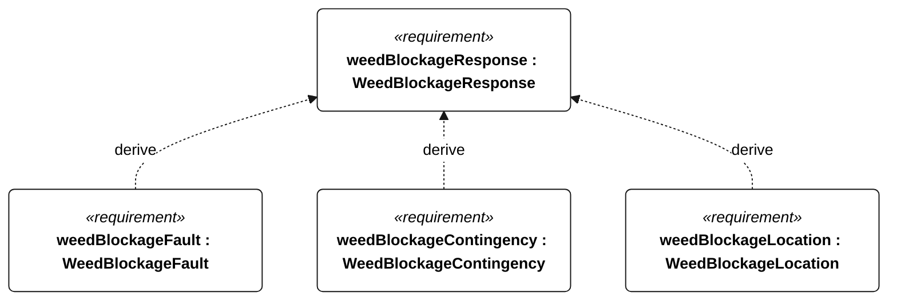
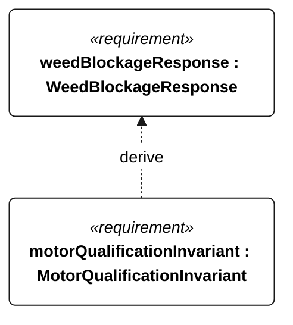

# N-055 weed blockage response

<!-- Generated from SysML by scripts/render_requirements.py; edit the model, not this file. -->

[All requirement views](<../requirements-views.md>)

[Qualification conditions, rationale, open issues and verification](<../requirements-context.md>)

**N-055 WeedBlockageResponse** — The vessel shall enter autonomous fouling contingency when the defined weed-blockage trigger occurs.

**N-130 WeedBlockageFault** — A suspected-fouling fault shall be logged within 10 seconds after the N-055 trigger.

**N-131 WeedBlockageContingency** — The vessel shall enter fouling-contingency state within 10 seconds after the N-055 trigger.

**N-132 WeedBlockageLocation** — Location reporting shall continue at the active telemetry cadence during fouling contingency whenever a link is available.

**R-101 MotorQualificationInvariant** — Motor thrust shall remain disabled whenever an attempt is qualifying or qualification status is unknown.

## N-055 derivation 1

## N-055 derivation 2

