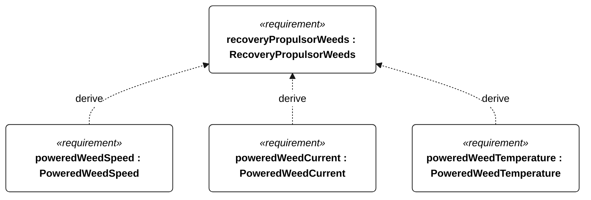
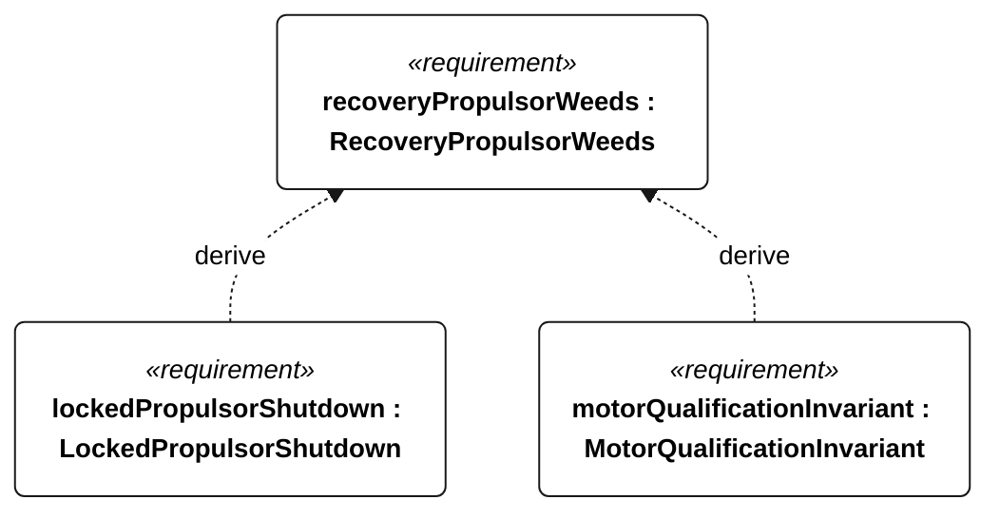

# N-056 recovery propulsor weeds

[All requirement views](<../requirements-views.md>)

**RecoveryPropulsorWeeds** — Aggregate requirement for RecoveryPropulsorWeeds. Acceptance requires all applicable derived leaf results (N-133, N-134, N-135, N-136, R-101); this parent has no independent executable pass/fail predicate. Shared verification context: Use a separately designated Gorge powered-recovery test with five passes through the N-053 patch without manual propulsor clearing, on the weed-free powered reference heading. Exercise locked propulsor separately.

**PoweredWeedSpeed** — Mean water-relative powered speed through each N-056 patch passage shall be at least 50 percent of weed-free reference speed. Verification uses the shared context of N-056.

**PoweredWeedCurrent** — Motor and controller currents shall remain within their respective rated limits during each N-056 patch passage. Verification uses the shared context of N-056.

**PoweredWeedTemperature** — Motor and controller temperatures shall remain within their respective rated limits during each N-056 patch passage. Verification uses the shared context of N-056.

**LockedPropulsorShutdown** — A locked propulsor shall cause motor shutdown within 2 seconds. Verification uses the shared context of N-056.

**MotorQualificationInvariant** — Motor thrust shall remain disabled whenever an attempt is qualifying or qualification status is unknown. Verification uses the shared context of R-004.

## N-056 derivation 1

## N-056 derivation 2

