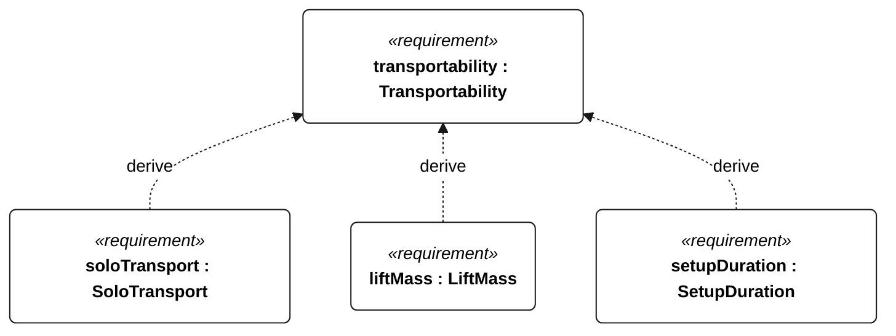
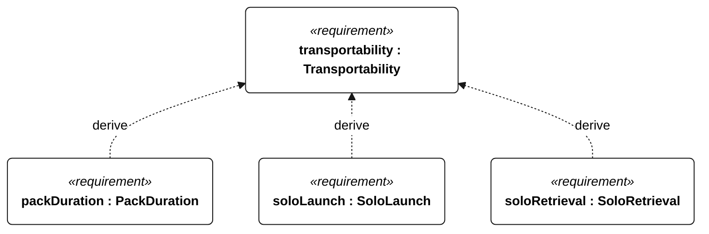

# P-001 transportability

[All requirement views](<../requirements-views.md>)

[Qualification conditions, rationale, open issues and verification](<../requirements-context.md>)

**P-001 Transportability** — The vessel shall support transport, assembly, launch and retrieval by one adult under the specified handling conditions.

**P-101 SoloTransport** — One adult shall move all mission equipment 100 m without assistance.

**P-102 LiftMass** — Each separately lifted assembly shall have a mass no greater than 15 kg.

**P-103 SetupDuration** — One adult shall assemble the vessel from its transport configuration within 30 minutes.

**P-104 PackDuration** — One adult shall pack the vessel into its transport configuration within 30 minutes.

**P-105 SoloLaunch** — One adult shall launch the assembled vessel without assistance.

**P-106 SoloRetrieval** — One adult shall retrieve the vessel from the water without assistance.

## P-001 derivation 1

## P-001 derivation 2

