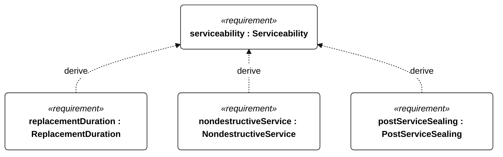
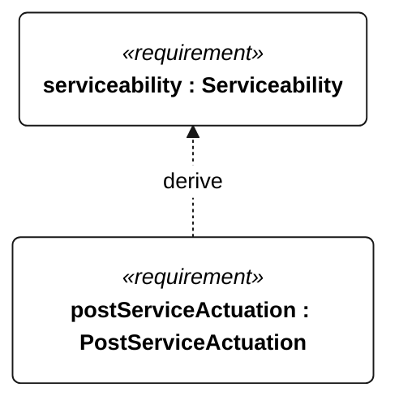

# P-003 serviceability

[All requirement views](<../requirements-views.md>)

[Qualification conditions, rationale, open issues and verification](<../requirements-context.md>)

**P-003 Serviceability** — The vessel shall support replacement of serviceable equipment without structural damage.

**P-107 ReplacementDuration** — Each P-003 replacement shall take no more than 30 minutes.

**P-108 NondestructiveService** — Each P-003 replacement shall leave bonded structural joints and adjacent parts intact.

**P-109 PostServiceSealing** — After each P-003 replacement, the assembly shall meet the N-043 immersion criterion.

**P-110 PostServiceActuation** — After each P-003 replacement, affected actuators shall complete their full commanded travel.

## P-003 derivation 1

## P-003 derivation 2

