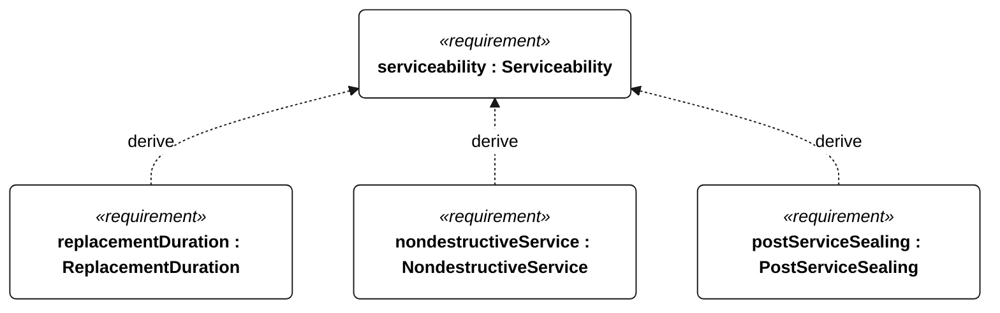
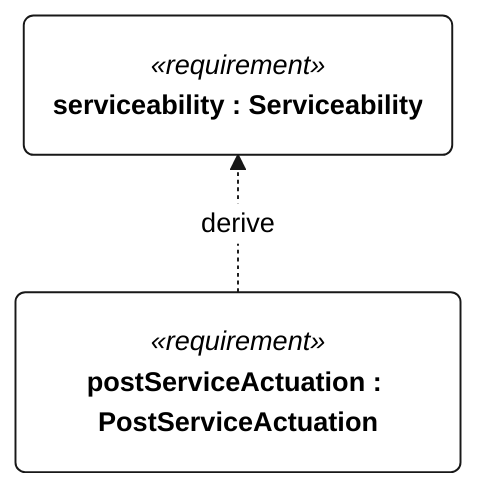

# P-003 serviceability

[All requirement views](<../requirements-views.md>)

**Serviceability** — Aggregate requirement for Serviceability. Acceptance requires all applicable derived leaf results (P-107, P-108, P-109, P-110); this parent has no independent executable pass/fail predicate. Shared verification context: Exercise individual replacement of the battery, every electronics module, every actuator and every serviceable enclosure seal by one operator using hand tools.

**ReplacementDuration** — Each P-003 replacement shall take no more than 30 minutes. Verification uses the shared context of P-003.

**NondestructiveService** — Each P-003 replacement shall leave bonded structural joints and adjacent parts intact. Verification uses the shared context of P-003.

**PostServiceSealing** — After each P-003 replacement, the assembly shall meet the N-043 immersion criterion. Verification uses the shared context of P-003.

**PostServiceActuation** — After each P-003 replacement, affected actuators shall complete their full commanded travel. Verification uses the shared context of P-003.

## P-003 derivation 1

## P-003 derivation 2

