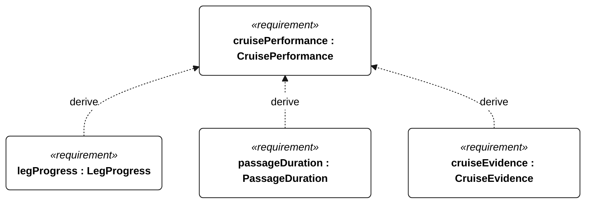

# Q-001 CruisePerformance relationships

<!-- Generated from SysML by scripts/render_requirements.py; edit the model, not this file. -->

[All requirement views](<../requirements-views.md>)

[Conditions, rationale and verification](<../requirements-context.md>)

**Q-001 CruisePerformance** — The vessel shall sustain sailing performance sufficient to complete each declared unassisted mission route.

**Q-101 LegProgress** — The vessel shall achieve at least 0.5 m/s mean along-route ground progress on each planned sailing leg.

**Q-102 PassageDuration** — The vessel shall complete the declared route within the qualified unassisted operating duration.

**Q-103 CruiseEvidence** — The cruise-performance assessment shall use accepted loaded-vessel sailing evidence for its declared mission profile.

## Q-001 relationships 1

