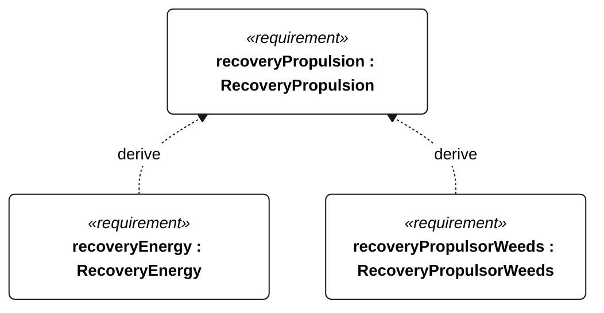

# R-001 recovery propulsion

<!-- Generated from SysML by scripts/render_requirements.py; edit the model, not this file. -->

[All requirement views](<../requirements-views.md>)

[Qualification conditions, rationale, open issues and verification](<../requirements-context.md>)

**R-001 RecoveryPropulsion** — At maximum mission load, powered recovery shall sustain at least 0.5 m/s over ground for 30 minutes against a 1.5 m/s current.

**R-002 RecoveryEnergy** — The protected reserve shall equal or exceed 1.2 × (30 minutes of worst-case recovery motor demand + 2 hours of essential recovery demand).

**N-056 RecoveryPropulsorWeeds** — The recovery propulsion system shall tolerate the specified weed encounters within its rated electrical and thermal limits.

## R-001 derivation 1

[Continue: R-002 recovery energy](<requirements-r-002.md>)

[Continue: N-056 recovery propulsor weeds](<requirements-n-056.md>)
