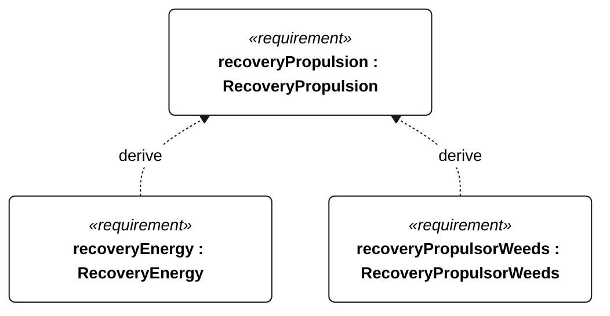

# R-001 recovery propulsion

[All requirement views](<../requirements-views.md>)

**RecoveryPropulsion** — At maximum mission load, auxiliary powered recovery shall sustain at least 0.5 m/s speed over ground for 30 minutes directly against a 1.5 m/s current, with wind no greater than 5 m/s and waves no greater than 0.2 m. Acceptance shall measure track, current and electrical power. This sheltered recovery target is not a storm-recovery guarantee; motor enable and challenge qualification shall comply with R-004, and isolation/control-loss behavior with S-003.

**RecoveryEnergy** — The protected recovery reserve shall be at least 1.2 times the sum of 30 minutes of worst-case electrical motor power measured in the R-001 recovery test and 2 hours of essential navigation/control/recording/telemetry electrical power measured at the S-003 recovery cadence. Motor and essential powers shall be separate, non-overlapping measurements. Reserve sizing shall use the selected installed configuration; available battery energy shall be characterized at the lowest operating battery temperature and end-of-service capacity. Launch admission is R-003; in-mission reserve crossing invokes E-004.

**RecoveryPropulsorWeeds** — Aggregate requirement for RecoveryPropulsorWeeds. Acceptance requires all applicable derived leaf results (N-133, N-134, N-135, N-136, R-101); this parent has no independent executable pass/fail predicate. Shared verification context: Use a separately designated Gorge powered-recovery test with five passes through the N-053 patch without manual propulsor clearing, on the weed-free powered reference heading. Exercise locked propulsor separately.

## R-001 derivation 1

[Continue: R-002 recovery energy](<requirements-r-002.md>)

[Continue: N-056 recovery propulsor weeds](<requirements-n-056.md>)
