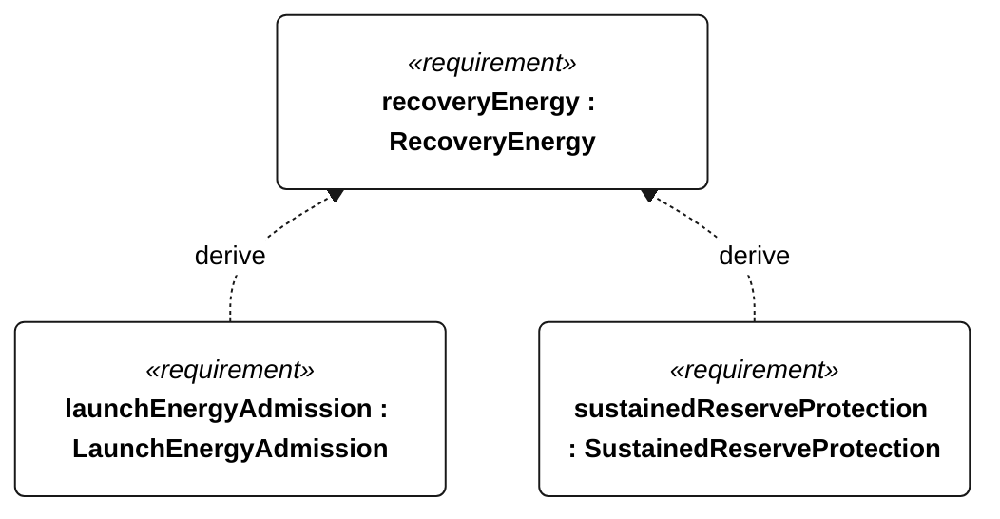

# R-002 recovery energy

[All requirement views](<../requirements-views.md>)

**RecoveryEnergy** — The protected recovery reserve shall be at least 1.2 times the sum of 30 minutes of worst-case electrical motor power measured in the R-001 recovery test and 2 hours of essential navigation/control/recording/telemetry electrical power measured at the S-003 recovery cadence. Motor and essential powers shall be separate, non-overlapping measurements. Reserve sizing shall use the selected installed configuration; available battery energy shall be characterized at the lowest operating battery temperature and end-of-service capacity. Launch admission is R-003; in-mission reserve crossing invokes E-004.

**LaunchEnergyAdmission** — The vessel shall inhibit mission start unless the conservative usable battery-energy estimate is strictly greater than the protected reserve sized under R-002. A missing, stale or invalid energy estimate or reserve configuration shall inhibit start. The estimate shall be no older than 1 second at admission. Acceptance shall inject values below, equal to and above the reserve and missing/invalid/stale inputs.

**SustainedReserveProtection** — Conservative stored energy shall remain strictly above the R-002 protected reserve throughout the selected sustained-operation profile. For piecewise-constant net power, check the initial state and every interval endpoint; unmodeled intrainterval dips are outside this claim.

## R-002 derivation 1

