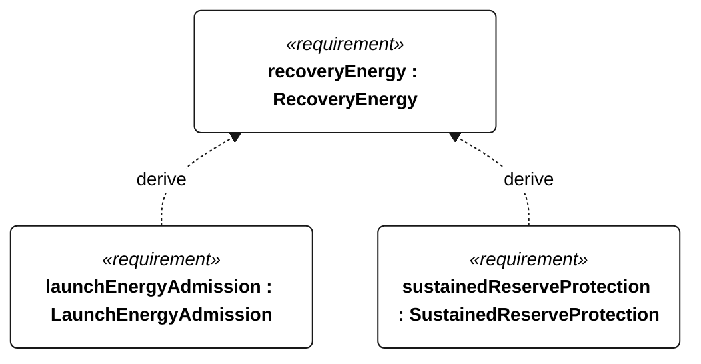

# R-002 recovery energy

[All requirement views](<../requirements-views.md>)

[Qualification conditions, rationale, open issues and verification](<../requirements-context.md>)

**R-002 RecoveryEnergy** — The protected reserve shall equal or exceed 1.2 × (30 minutes of worst-case recovery motor demand + 2 hours of essential recovery demand).

**R-003 LaunchEnergyAdmission** — Mission start shall remain inhibited unless a valid usable-energy estimate no older than 1 second strictly exceeds a valid R-002 protected reserve.

**E-201 SustainedReserveProtection** — Conservative stored energy shall remain strictly above the R-002 protected reserve throughout the selected sustained-operation profile.

## R-002 derivation 1

