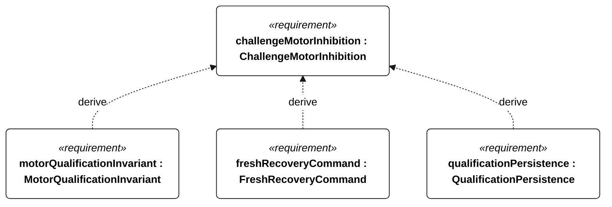
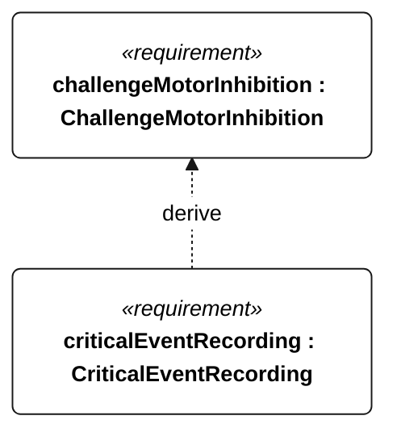

# R-004 challenge motor inhibition

[All requirement views](<../requirements-views.md>)

**ChallengeMotorInhibition** — Aggregate requirement for ChallengeMotorInhibition. Acceptance requires all applicable derived leaf results (R-101, R-102, E-138, E-132); this parent has no independent executable pass/fail predicate. Shared verification context: Exercise qualifying, nonqualifying and unknown qualification states, restart, link loss, power loss during transitions and conflicting/stale commands. Shared qualification persistence applies before enabling intervention.

**MotorQualificationInvariant** — Motor thrust shall remain disabled whenever an attempt is qualifying or qualification status is unknown. Verification uses the shared context of R-004.

**FreshRecoveryCommand** — After restart, motor enable shall remain inhibited until a fresh authenticated recovery command is accepted. Verification uses the shared context of R-004.

**QualificationPersistence** — Each disqualifying transition shall be durably stored before its associated commanded intervention or motor enable. Verification uses the shared context of E-007.

**CriticalEventRecording** — Every external-command disposition, reset, motor-enable transition, ingress detection, recovery request, navigation-degraded transition, low-energy flag transition and qualification change shall have an event record regardless of periodic cadence. Verification uses the shared context of E-007.

## R-004 derivation 1

## R-004 derivation 2

