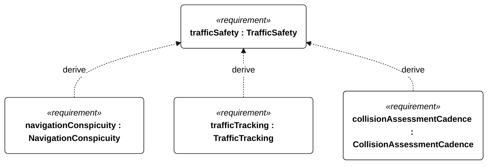
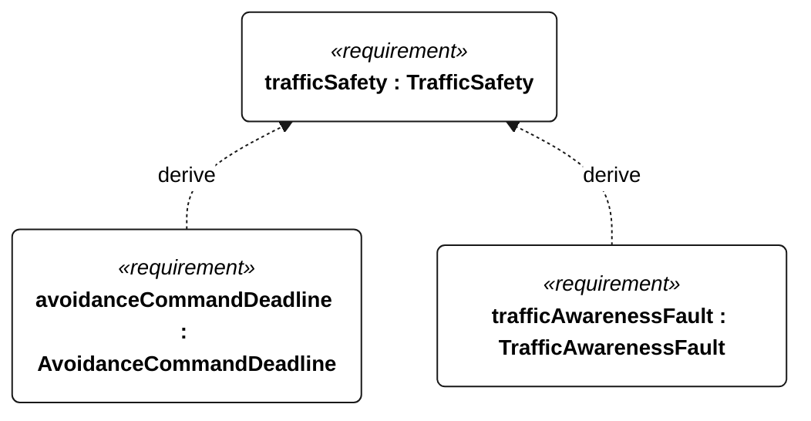

# S-001 traffic safety

[All requirement views](<../requirements-views.md>)

**TrafficSafety** — Aggregate requirement for TrafficSafety. Acceptance requires all applicable derived leaf results (S-101, S-102, S-103, S-104); this parent has no independent executable pass/fail predicate. Shared verification context: Use independently recorded head-on, crossing and overtaking AIS and non-AIS targets, day and night in the selected operational profile. Detection ranges, target signatures, closest-approach margins and maneuver feasibility remain unresolved acceptance parameters; tracking and avoidance cannot receive complete passes until these are frozen.

**NavigationConspicuity** — Aggregate requirement for NavigationConspicuity. Acceptance requires all applicable derived leaf results (S-116, S-117, S-118, S-119, S-120, S-121); this parent has no independent executable pass/fail predicate. Shared verification context: Use the deployment-specific compliance matrix for sailing, powered-recovery and stationary modes, including its visibility, arcs, colors and sound criteria. The matrix remains a deployment hold point under S-005.

**TrafficTracking** — The vessel shall maintain a track for every encounter target within the frozen S-001 detection envelope. Verification uses the shared context of S-001.

**CollisionAssessmentCadence** — The vessel shall update collision-risk estimates at least once per second. Verification uses the shared context of S-001.

**AvoidanceCommandDeadline** — The vessel shall issue the prescribed avoiding-action command within 2 seconds of each S-001 collision-risk trigger. Verification uses the shared context of S-001.

**TrafficAwarenessFault** — After traffic assessment has been invalid for more than 5 seconds, the vessel shall log a traffic-awareness fault within 1 second. Verification uses the shared context of S-001.

## S-001 derivation 1

## S-001 derivation 2

[Continue: S-004 navigation conspicuity](<requirements-s-004.md>)
