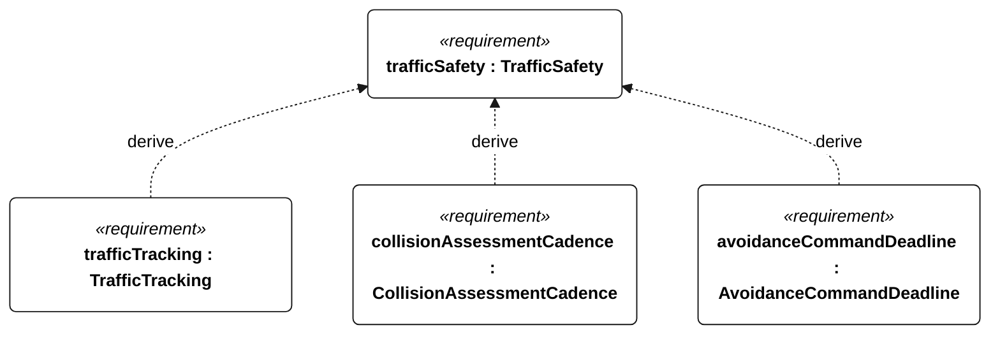
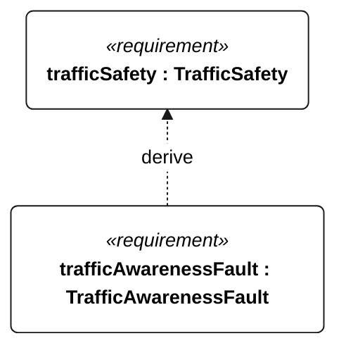

# S-001 TrafficSafety relationships

<!-- Generated from SysML by scripts/render_requirements.py; edit the model, not this file. -->

[All requirement views](<../requirements-views.md>)

[Conditions, rationale and verification](<../requirements-context.md>)

**S-001 TrafficSafety** — The vessel shall assess and respond to collision risks within the deployment-specific traffic envelope.

**S-101 TrafficTracking** — The vessel shall maintain a track for every encounter target within the frozen S-001 detection envelope.

**S-102 CollisionAssessmentCadence** — The vessel shall update collision-risk estimates at least once per second.

**S-103 AvoidanceCommandDeadline** — The vessel shall issue the prescribed avoiding-action command within 2 seconds of each S-001 collision-risk trigger.

**S-104 TrafficAwarenessFault** — After traffic assessment has been invalid for more than 5 seconds, the vessel shall log a traffic-awareness fault within 1 second.

## S-001 relationships 1

## S-001 relationships 2

## Design decisions motivated by this requirement

Plain dependencies record design basis, not derivation or refinement. The native GeneralView renderer does not draw these dependencies; their actual endpoints and rationale are reported here.

| Dependent requirement | Design basis | Rationale |
| --- | --- | --- |
| navigationConspicuity | trafficSafety | NavigationConspicuity supports trafficSafety. This is design motivation or an implementation choice, not a satisfaction implication. |

[Continue: S-004 NavigationConspicuity](<requirements-s-004.md>)
