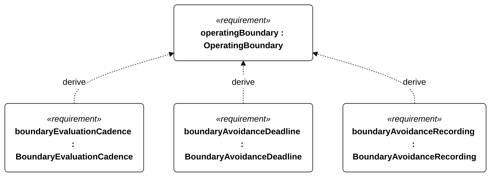
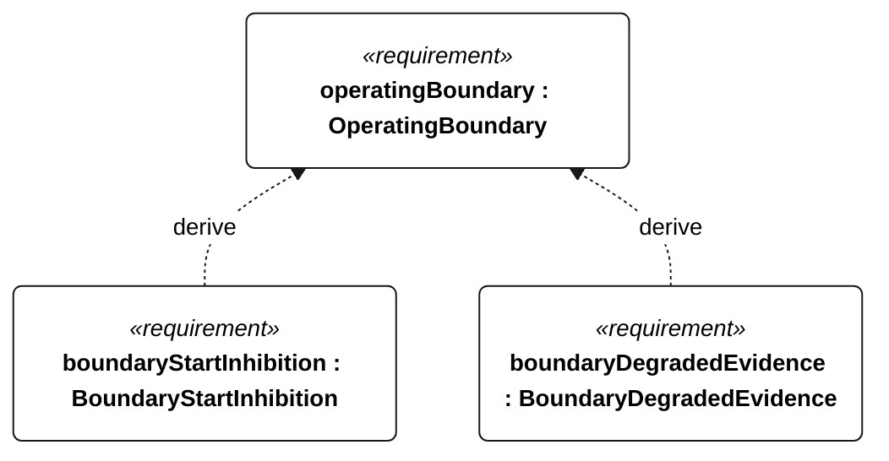

# S-002 operating boundary

[All requirement views](<../requirements-views.md>)

[Qualification conditions, rationale, open issues and verification](<../requirements-context.md>)

**S-002 OperatingBoundary** — The vessel shall enforce the configured operating boundaries.

**S-105 BoundaryEvaluationCadence** — The vessel shall evaluate its current position and predicted trajectory against the S-002 polygons at least once per second.

**S-106 BoundaryAvoidanceDeadline** — The vessel shall issue an avoidance command within 2 seconds of predicting a boundary crossing.

**S-107 BoundaryAvoidanceRecording** — Every boundary-avoidance command shall have a corresponding event record.

**S-108 BoundaryStartInhibition** — Missing or geometrically invalid boundaries shall inhibit mission start.

**S-109 BoundaryDegradedEvidence** — Navigation loss or absence of a feasible maneuver shall produce an explicit degraded-route verdict instead of a safe-route verdict.

## S-002 derivation 1

## S-002 derivation 2

