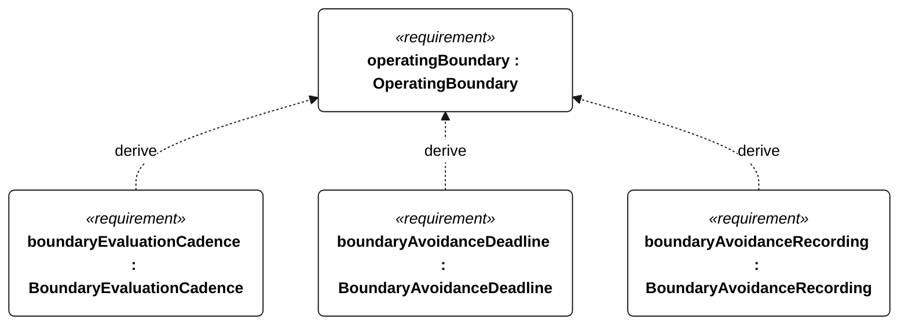
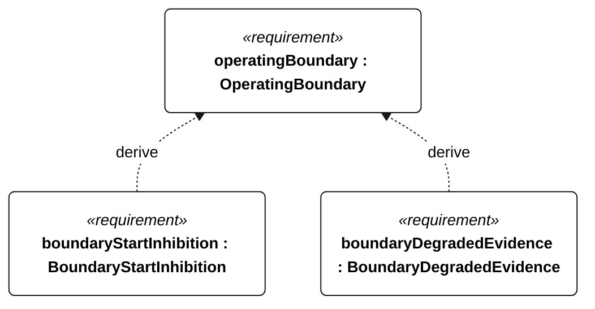

# S-002 operating boundary

[All requirement views](<../requirements-views.md>)

**OperatingBoundary** — Aggregate requirement for OperatingBoundary. Acceptance requires all applicable derived leaf results (S-105, S-106, S-107, S-108, S-109); this parent has no independent executable pass/fail predicate. Shared verification context: Use uploaded permitted-water and exclusion polygons, with a 60-second prediction horizon. Inject approaches to every boundary, navigation loss and no-feasible-maneuver cases. Coordinates and uncertainty/clearance margins are controlled mission inputs with no default values.

**BoundaryEvaluationCadence** — The vessel shall evaluate its current position and predicted trajectory against the S-002 polygons at least once per second. Verification uses the shared context of S-002.

**BoundaryAvoidanceDeadline** — The vessel shall issue an avoidance command within 2 seconds of predicting a boundary crossing. Verification uses the shared context of S-002.

**BoundaryAvoidanceRecording** — Every boundary-avoidance command shall have a corresponding event record. Verification uses the shared context of S-002.

**BoundaryStartInhibition** — Missing or geometrically invalid boundaries shall inhibit mission start. Verification uses the shared context of S-002.

**BoundaryDegradedEvidence** — Navigation loss or absence of a feasible maneuver shall produce an explicit degraded-route verdict instead of a safe-route verdict. Verification uses the shared context of S-002.

## S-002 derivation 1

## S-002 derivation 2

