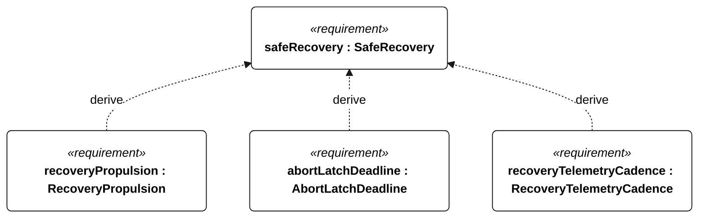
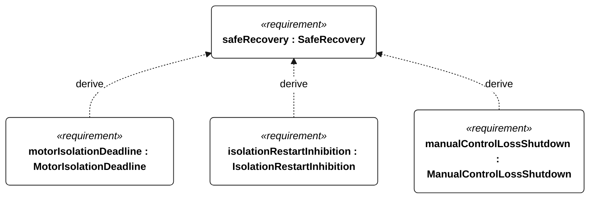
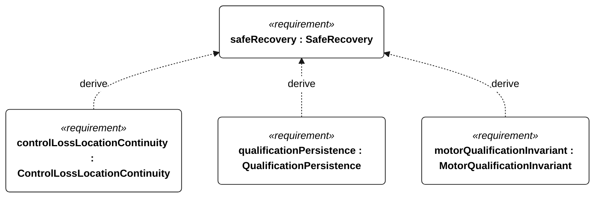
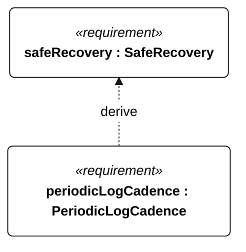

# S-003 safe recovery

[All requirement views](<../requirements-views.md>)

**SafeRecovery** — Aggregate requirement for SafeRecovery. Acceptance requires all applicable derived leaf results (S-110, S-111, S-112, S-113, S-114, S-115, E-138, R-101, E-130); this parent has no independent executable pass/fail predicate. Shared verification context: Emergency intervention ends attempt qualification. Exercise active emergency, powered recovery, local isolation and remote-control loss, including coexisting low-energy flags.

**RecoveryPropulsion** — At maximum mission load, auxiliary powered recovery shall sustain at least 0.5 m/s speed over ground for 30 minutes directly against a 1.5 m/s current, with wind no greater than 5 m/s and waves no greater than 0.2 m. Acceptance shall measure track, current and electrical power. This sheltered recovery target is not a storm-recovery guarantee; motor enable and challenge qualification shall comply with R-004, and isolation/control-loss behavior with S-003.

**AbortLatchDeadline** — After accepting emergency abort, the vessel shall latch the attempt as disqualified within 1 second. Verification uses the shared context of S-003.

**RecoveryTelemetryCadence** — During active emergency or powered recovery with a functioning link, the vessel shall deliver position telemetry at least once per 60 seconds, including low-energy operation. Verification uses the shared context of S-003.

**MotorIsolationDeadline** — A physically accessible local isolation control shall remove motor power within 1 second of activation. Verification uses the shared context of S-003.

**IsolationRestartInhibition** — Motor restart shall remain inhibited after local isolation until deliberate local reset. Verification uses the shared context of S-003.

**ManualControlLossShutdown** — After remote control has been lost for 5 seconds during manual powered recovery, the vessel shall command zero thrust within a further 1 second. Verification uses the shared context of S-003.

**ControlLossLocationContinuity** — Location reporting shall continue at the active telemetry cadence after remote-control loss whenever a telemetry link is available. Verification uses the shared context of S-003.

**QualificationPersistence** — Each disqualifying transition shall be durably stored before its associated commanded intervention or motor enable. Verification uses the shared context of E-007.

**MotorQualificationInvariant** — Motor thrust shall remain disabled whenever an attempt is qualifying or qualification status is unknown. Verification uses the shared context of R-004.

**PeriodicLogCadence** — Periodic mission records shall be acquired at least once per second normally and once per minute in low-energy or survival operation. Verification uses the shared context of E-007.

## S-003 derivation 1

## S-003 derivation 2

## S-003 derivation 3

## S-003 derivation 4

[Continue: R-001 recovery propulsion](<requirements-r-001.md>)
