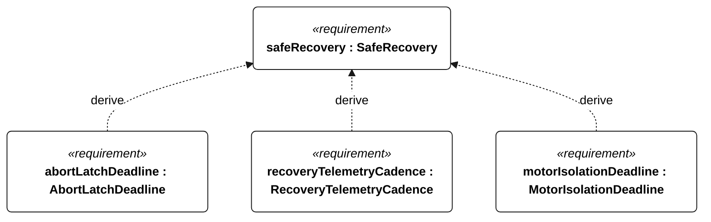
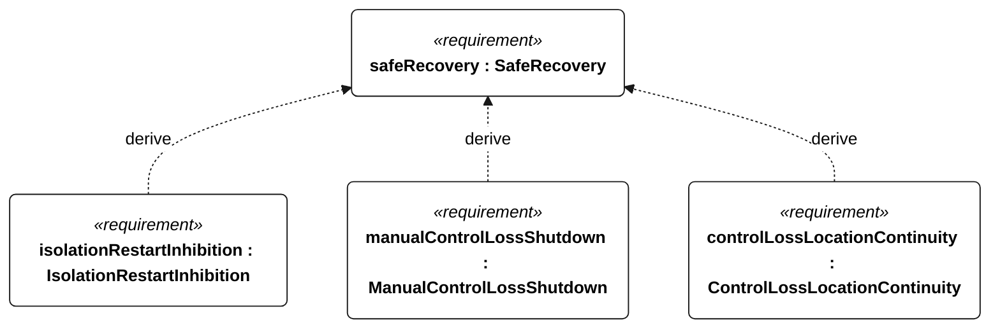
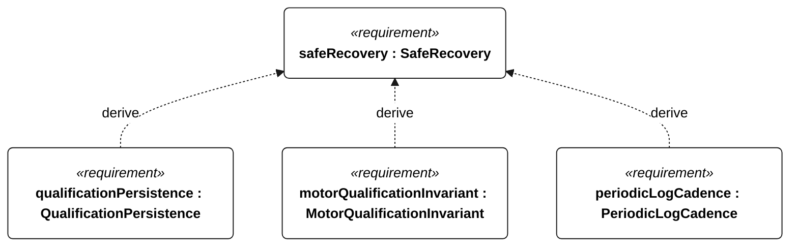

# S-003 SafeRecovery relationships

<!-- Generated from SysML by scripts/render_requirements.py; edit the model, not this file. -->

[All requirement views](<../requirements-views.md>)

[Conditions, rationale and verification](<../requirements-context.md>)

**S-003 SafeRecovery** — The vessel shall support controlled emergency intervention and powered recovery.

**S-110 AbortLatchDeadline** — After accepting emergency abort, the vessel shall latch the attempt as disqualified within 1 second.

**S-111 RecoveryTelemetryCadence** — During active emergency or powered recovery with a functioning link, the vessel shall deliver position telemetry at least once per 60 seconds, including low-energy operation.

**S-112 MotorIsolationDeadline** — A physically accessible local isolation control shall remove motor power within 1 second of activation.

**S-113 IsolationRestartInhibition** — Motor restart shall remain inhibited after local isolation until deliberate local reset.

**S-114 ManualControlLossShutdown** — After remote control has been lost for 5 seconds during manual powered recovery, the vessel shall command zero thrust within a further 1 second.

**S-115 ControlLossLocationContinuity** — Location reporting shall continue at the active telemetry cadence after remote-control loss whenever a telemetry link is available.

**E-138 QualificationPersistence** — Each disqualifying transition shall be durably stored before its associated commanded intervention or motor enable.

**R-101 MotorQualificationInvariant** — Motor thrust shall remain disabled whenever an attempt is qualifying or qualification status is unknown.

**E-130 PeriodicLogCadence** — Periodic mission records shall be acquired at least once per second normally and once per minute in low-energy or survival operation.

## S-003 relationships 1

## S-003 relationships 2

## S-003 relationships 3

## Design decisions motivated by this requirement

Plain dependencies record design basis, not derivation or refinement. The native GeneralView renderer does not draw these dependencies; their actual endpoints and rationale are reported here.

| Dependent requirement | Design basis | Rationale |
| --- | --- | --- |
| recoveryPropulsion | safeRecovery | RecoveryPropulsion supports safeRecovery. This is design motivation or an implementation choice, not a satisfaction implication. |

[Continue: R-001 RecoveryPropulsion](<requirements-r-001.md>)
