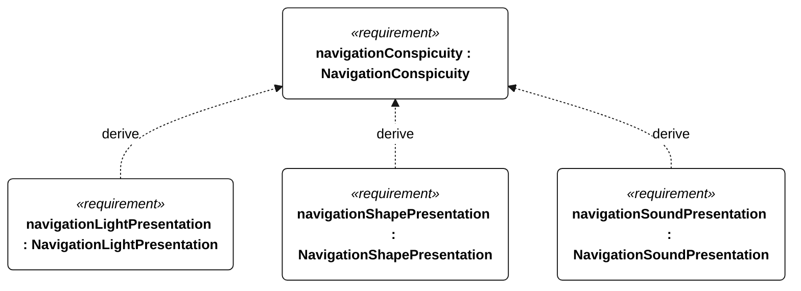
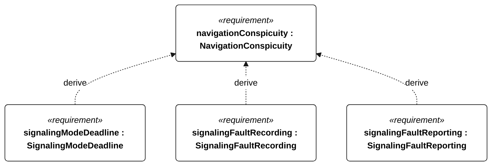

# S-004 navigation conspicuity

[All requirement views](<../requirements-views.md>)

[Qualification conditions, rationale, open issues and verification](<../requirements-context.md>)

**S-004 NavigationConspicuity** — The vessel shall present the navigation signals required for its operating mode.

**S-116 NavigationLightPresentation** — The vessel shall present the lights prescribed for its current mode by the S-004 compliance matrix without a person aboard.

**S-117 NavigationShapePresentation** — The vessel shall present the shapes prescribed for its current mode by the S-004 compliance matrix without a person aboard.

**S-118 NavigationSoundPresentation** — The vessel shall present the sound signals prescribed for its current mode by the S-004 compliance matrix without a person aboard.

**S-119 SignalingModeDeadline** — A commanded mode change shall select the corresponding signaling configuration within 1 second.

**S-120 SignalingFaultRecording** — Each detectable signaling failure shall be logged within 5 seconds of detection.

**S-121 SignalingFaultReporting** — With a functioning link, each detected signaling failure shall be reported to shore within 5 seconds.

## S-004 derivation 1

## S-004 derivation 2

