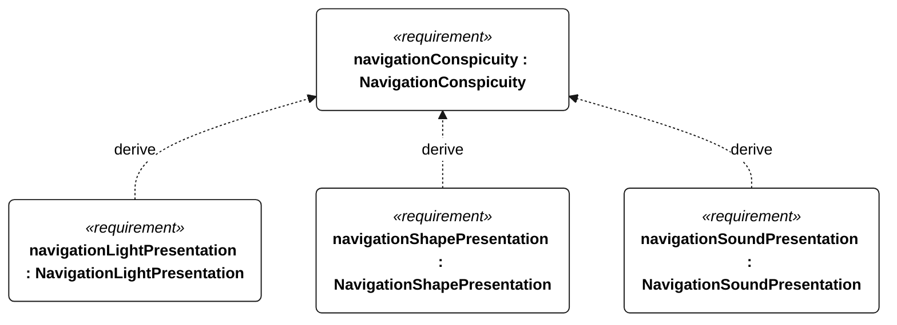
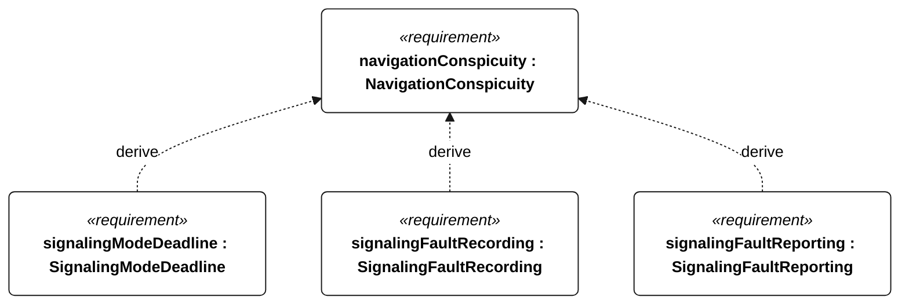

# S-004 navigation conspicuity

[All requirement views](<../requirements-views.md>)

**NavigationConspicuity** — Aggregate requirement for NavigationConspicuity. Acceptance requires all applicable derived leaf results (S-116, S-117, S-118, S-119, S-120, S-121); this parent has no independent executable pass/fail predicate. Shared verification context: Use the deployment-specific compliance matrix for sailing, powered-recovery and stationary modes, including its visibility, arcs, colors and sound criteria. The matrix remains a deployment hold point under S-005.

**NavigationLightPresentation** — The vessel shall present the lights prescribed for its current mode by the S-004 compliance matrix without a person aboard. Verification uses the shared context of S-004.

**NavigationShapePresentation** — The vessel shall present the shapes prescribed for its current mode by the S-004 compliance matrix without a person aboard. Verification uses the shared context of S-004.

**NavigationSoundPresentation** — The vessel shall present the sound signals prescribed for its current mode by the S-004 compliance matrix without a person aboard. Verification uses the shared context of S-004.

**SignalingModeDeadline** — A commanded mode change shall select the corresponding signaling configuration within 1 second. Verification uses the shared context of S-004.

**SignalingFaultRecording** — Each detectable signaling failure shall be logged within 5 seconds of detection. Verification uses the shared context of S-004.

**SignalingFaultReporting** — With a functioning link, each detected signaling failure shall be reported to shore within 5 seconds. Verification uses the shared context of S-004.

## S-004 derivation 1

## S-004 derivation 2

