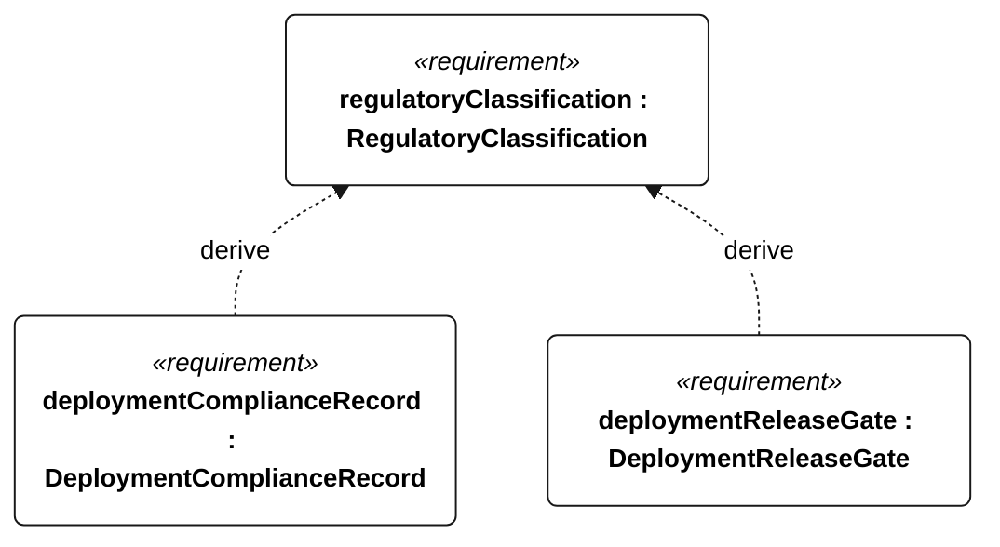

# S-005 regulatory classification

[All requirement views](<../requirements-views.md>)

[Qualification conditions, rationale, open issues and verification](<../requirements-context.md>)

**S-005 RegulatoryClassification** — Deployment shall require documented compliance with applicable navigation, radio and authorization obligations.

**S-122 DeploymentComplianceRecord** — Each deployment shall have a dated compliance record identifying the craft, dimensions, waters, operating modes, applicable navigation and radio obligations, and permission evidence.

**S-123 DeploymentReleaseGate** — Deployment release shall be withheld while any mandatory authorization is absent, expired or unresolved.

## S-005 derivation 1

