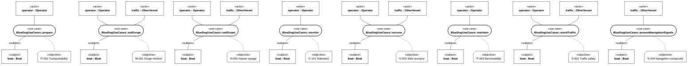

# Use cases and requirements

```mermaid
---
config:
  fontFamily: "Helvetica, Arial, sans-serif"
  theme: base
  themeCSS: ".edgeLabel rect { opacity: 1 !important; } .cluster-label .nodeLabel { text-align: center; }"
  themeVariables:
    fontFamily: "Helvetica, Arial, sans-serif"
    fontSize: "14px"
    primaryColor: "#FFFFFF"
    secondaryColor: "#FFFFFF"
    tertiaryColor: "#FFFFFF"
    background: "#FFFFFF"
    primaryBorderColor: "#181818"
    primaryTextColor: "#000000"
    lineColor: "#181818"
    textColor: "#000000"
    noteBkgColor: "#FEFFDD"
    noteBorderColor: "#181818"
    noteTextColor: "#000000"
    clusterBkg: "#FFFFFF"
    clusterBorder: "#181818"
    edgeLabelBackground: "#FFFFFF"
---
%% BlueDogUseCaseViews::operations — case rendering (view def GeneralView, filter @UseCaseUsage)
flowchart TB
  n0(["`*«use case»*
**BlueDogUseCases::prepare**`"])
  n1["`*«subject»*
**boat : Boat**`"]
  n2["`*«actor»*
**operator : Operator**`"]
  n3@{ shape: notch-rect, label: "«objective»<br>'P-001 Transportability'" }
  n4(["`*«use case»*
**BlueDogUseCases::sailGorge**`"])
  n5["`*«subject»*
**boat : Boat**`"]
  n6["`*«actor»*
**operator : Operator**`"]
  n7["`*«actor»*
**traffic : OtherVessel**`"]
  n8@{ shape: notch-rect, label: "«objective»<br>'M-001 Gorge mission'" }
  n9(["`*«use case»*
**BlueDogUseCases::sailOcean**`"])
  n10["`*«subject»*
**boat : Boat**`"]
  n11["`*«actor»*
**operator : Operator**`"]
  n12["`*«actor»*
**traffic : OtherVessel**`"]
  n13@{ shape: notch-rect, label: "«objective»<br>'H-001 Hawaii voyage'" }
  n14(["`*«use case»*
**BlueDogUseCases::monitor**`"])
  n15["`*«subject»*
**boat : Boat**`"]
  n16["`*«actor»*
**operator : Operator**`"]
  n17@{ shape: notch-rect, label: "«objective»<br>'C-101 Telemetry'" }
  n18(["`*«use case»*
**BlueDogUseCases::recover**`"])
  n19["`*«subject»*
**boat : Boat**`"]
  n20["`*«actor»*
**operator : Operator**`"]
  n21["`*«actor»*
**traffic : OtherVessel**`"]
  n22@{ shape: notch-rect, label: "«objective»<br>'S-003 Safe recovery'" }
  n23(["`*«use case»*
**BlueDogUseCases::maintain**`"])
  n24["`*«subject»*
**boat : Boat**`"]
  n25["`*«actor»*
**operator : Operator**`"]
  n26@{ shape: notch-rect, label: "«objective»<br>'P-003 Serviceability'" }
  n27(["`*«use case»*
**BlueDogUseCases::avoidTraffic**`"])
  n28["`*«subject»*
**boat : Boat**`"]
  n29["`*«actor»*
**operator : Operator**`"]
  n30["`*«actor»*
**traffic : OtherVessel**`"]
  n31@{ shape: notch-rect, label: "«objective»<br>'S-001 Traffic safety'" }
  n32(["`*«use case»*
**BlueDogUseCases::presentNavigationSignals**`"])
  n33["`*«subject»*
**boat : Boat**`"]
  n34["`*«actor»*
**traffic : OtherVessel**`"]
  n35@{ shape: notch-rect, label: "«objective»<br>'S-004 Navigation conspicuity'" }
  n0 ---|"«subject»"| n1
  n2 --- n0
  n0 -.- n3
  n4 ---|"«subject»"| n5
  n6 --- n4
  n7 --- n4
  n4 -.- n8
  n9 ---|"«subject»"| n10
  n11 --- n9
  n12 --- n9
  n9 -.- n13
  n14 ---|"«subject»"| n15
  n16 --- n14
  n14 -.- n17
  n18 ---|"«subject»"| n19
  n20 --- n18
  n21 --- n18
  n18 -.- n22
  n23 ---|"«subject»"| n24
  n25 --- n23
  n23 -.- n26
  n27 ---|"«subject»"| n28
  n29 --- n27
  n30 --- n27
  n27 -.- n31
  n32 ---|"«subject»"| n33
  n34 --- n32
  n32 -.- n35
```
