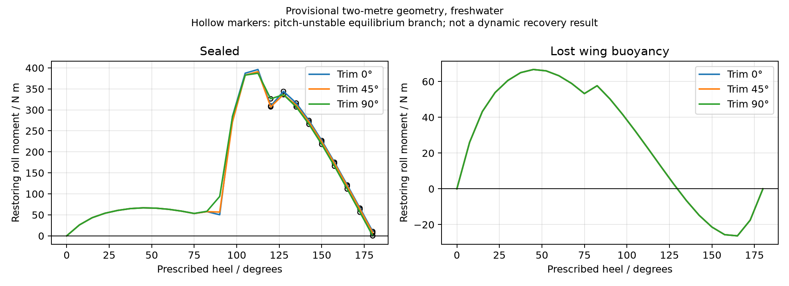

# Full-angle static recovery diagnostic

<!-- Generated by scripts.publish_hydrostatics from the saved native-kernel analysis. -->

This diagnostic applies a geometry-based buoyancy model to the saved two-metre sizing design. **It is not a capsize qualification or an optimized design.** The hull/wing geometry is provisional and its material mass has not yet been recalculated.

The sealed-wing cases have restoring roll moments at the sampled interior angles. Removing wing buoyancy produces a non-restoring roll region near inversion. This makes sealed volume and damage/flooding cases sizing inputs; the old below-bottom CG screen cannot replace them. Pitch-unstable branches are retained and identified rather than silently discarded.

## Cases

| Water density (kg/m³) | Mast trim (deg) | Wing buoyancy | Minimum signed restoring moment, sampled interior (N m) | Pitch-unstable samples |
|---:|---:|---|---:|---:|
| 1000 | 0 | sealed | 26.04 | 18 |
| 1000 | 0 | lost wing buoyancy | -26.29 | 0 |
| 1000 | 45 | sealed | 26.04 | 18 |
| 1000 | 45 | lost wing buoyancy | -26.29 | 0 |
| 1000 | 90 | sealed | 26.04 | 18 |
| 1000 | 90 | lost wing buoyancy | -26.29 | 0 |
| 1025 | 0 | sealed | 26.37 | 18 |
| 1025 | 0 | lost wing buoyancy | -26.83 | 0 |
| 1025 | 45 | sealed | 26.37 | 18 |
| 1025 | 45 | lost wing buoyancy | -26.83 | 0 |
| 1025 | 90 | sealed | 26.37 | 18 |
| 1025 | 90 | lost wing buoyancy | -26.83 | 0 |

Signed restoring moment is positive toward upright on either side. The sweep includes both sides from -180 to +180 degrees in 7.5-degree increments. Interior minima exclude upright and exact inversion; they do not establish positive moment between samples or eliminate all other three-dimensional equilibria.

## Geometry refinement

| Wing state | Heel (deg) | Coarse moment (N m) | Refined moment (N m) | Change (N m) |
|---|---:|---:|---:|---:|
| sealed | 15 | 43.24 | 43.41 | 0.18 |
| sealed | 90 | 50.27 | 50.10 | -0.17 |
| sealed | 135 | 316.24 | 316.12 | -0.13 |
| sealed | 165 | 121.10 | 121.08 | -0.02 |
| lost wing buoyancy | 15 | 43.24 | 43.41 | 0.18 |
| lost wing buoyancy | 90 | 50.27 | 50.10 | -0.17 |
| lost wing buoyancy | 135 | -6.58 | -6.90 | -0.32 |
| lost wing buoyancy | 165 | -26.29 | -26.56 | -0.27 |

Hull and ballast tessellation increases from resolution 8 to 16 at these points; the CAD wing section uses 40 chord strips. This is numerical sensitivity evidence, not geometry validation.

## Method and assumptions

[hydrostatics.sysml](../models/hydrostatics.sysml) owns exact planar clipping of each tetrahedron, displaced volume/first moments, and gravity/buoyancy balance. Python constructs geometry and solves immersion and pitch numerically; a small C adapter batches calls to the generated SysML kernel. Independent tests compare clipped shapes with a convex-hull oracle and analytic box stability.

Diagnostic only: new elliptical-planform hull family with saved design dimensions/mass/CG; rectangular wing from CAD midsection. Prescribed roll with heave and pitch equilibrium; nearest-zero pitch equilibrium within +/-85 degrees, pitch stability and alternative stable branches recorded. No dynamic release or global equilibrium proof. Lost-wing-buoyancy is a conservative sensitivity omitting material buoyancy, not a detailed flooded-body model. Keel/rudder structural displacement omitted. Retained water absent. Hull and wing material mass not yet recomputed for these shapes. No capsize requirement verdict.

The hull has an elliptical planform, rounded bottom and vertical topsides. The wing is a rectangular extrusion of the CAD midsection, trimmed about mid-chord; camber and mast fraction are parameterized. Ballast is a provisional 3:1:1 ellipsoid. Component geometry does not overlap. Dynamic recovery, wave loads, retained water, compartment flooding and revised geometry-derived structural mass remain integration work.

## Reproduce

Compile on Windows with `uv run python -m scripts.native_hydrostatics`. Run `python -m scripts.study_hydrostatics` in the Linux/GCC numerical environment, then `uv run python -m scripts.publish_hydrostatics`. Run `python -m pytest tests/test_hydrostatics.py` in that numerical environment.

The next sizing integration will use these geometry calculations with recalculated mass, actuator loads and candidate-specific aerodynamics. See [coupled sizing](coupled-sizing.md).
