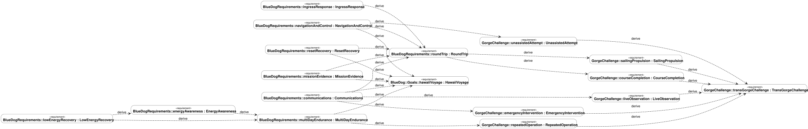

# Mission and requirements

Working baseline, October 9, 2026. The independent [challenge brief](challenge-brief.md) is defined in [challenge.sysml](../models/challenge.sysml) and imported by the vehicle requirements. Mission and architecture are in [blue-dog.sysml](../models/blue-dog.sysml); requirements and explicit derivations are in [requirements.sysml](../models/requirements.sysml). This page records decisions, rationale, and open questions; requirement definitions belong in the model.

## Mission agreed with David

The agreed threshold is completion of an autonomous sailing journey from The Dalles to Bonneville and back to The Dalles. The objective is to autonomously repeat The Dalles-Bonneville-The Dalles route for as long as practical. This replaces the earlier indefinite-operation wording: no fixed objective duration has been agreed. A qualifying round trip must be completed without operator intervention. Live operator monitoring is required. Termination conditions, monitoring coverage, and update interval remain to be agreed. Multi-day endurance with energy harvesting remains an earlier design intent to refine against this objective. Supervised local trials are proposed validation steps toward that mission, not a replacement design target.

The original Microtransat inspiration became a smaller trans-gorge idea: complete the Gorge Blowout course, with the longer round trip as an ambition. David selected the round trip as the electronics design mission on October 9, 2026.

Project objectives are to learn sailing, explore desktop manufacturing, build a complete autonomous system, and learn SysML v2 by modeling the mission and architecture. A persistent swell-monitoring mission with station keeping remains a stretch objective.

"Set and forget" now means no operator intervention during a qualifying round trip, while allowing live observation. Monitoring does not imply approval of remote mission guidance. Loss of the monitoring link shall not interrupt autonomous mission execution. The vessel shall retain telemetry onboard during the outage and transmit the retained data when contact returns. Retention duration and backlog transmission priority remain open. A remote emergency override for mission abort or manual control is required when a command link is available. Using it disqualifies that attempt as an unassisted round trip; passive monitoring does not. Abort behavior, control handover, and recovery support remain to be defined. No route coordinates, dam passages, or operating permissions are assumed by this model.

Auxiliary motor propulsion is allowed for development tests but prohibited during a qualifying challenge attempt (C-004). An auxiliary motor may remain installed and be used for vessel recovery outside a qualifying attempt. Using it during an attempt ends that attempt without qualification.

## Long-term direction

The long-term ambition is to work toward a vessel capable of making a voyage to Hawai‘i.
The Gorge is intended as a "torture test" for autonomy, endurance, and reliability.
The current baseline is the repeated Gorge route; an ocean departure point, passage
route, duration, and ocean-specific acceptance criteria have not been selected.
Gorge experience will inform that future mission, rather than establish ocean readiness by itself.

## Proposed mission decomposition

Prepare and launch; sail outbound; turn around; sail home to complete the threshold round trip; continue repeating the route for the endurance objective; eventually recover the boat and data. Energy management, health monitoring/recovery, communication, and data recording support the mission throughout. The initial SysML actions express decomposition only; sequencing, concurrency, triggers, and abort paths are the next modeling step.

## Requirements maturity

- **Confirmed intent:** C-001 and C-002 distinguish the round-trip threshold from the repeated autonomous operation objective; M-001 adopts the imported challenge for the vessel. M-002 retains the earlier multi-day endurance and energy-harvesting intent pending refinement. Quantitative acceptance criteria remain open.
- **Confirmed intent:** E-005 live operator monitoring, with coverage, data, and update interval still open.
- **Legacy intent:** reset recovery, limp mode, and hull-breach resilience from the December 2023 brief. They need refinement and reconfirmation against this mission.
- **Proposed:** energy awareness, navigation/control responsibilities, and mission evidence recording. These are discussion candidates, not approved specifications.

Self-righting, weed resistance, printable hull geometry, and collision-avoidance/compliance goals are system-level concerns to carry into later model revisions. The old frame cost target does not establish an electronics budget. The 2023 component list is historical input, not the selected architecture.

## Requirement derivation

[PNG version](figures/requirements-derivation.png) | [Generated requirement statements and derivation rationale](requirements-register.md)

Every dashed arrow comes from an explicit `#derivation` connection in the SysML model, with `#original` and `#derive` ends. Native OpenSysML arrows read from derived to original requirement. Maturity and short IDs are listed in the register rather than encoded as node colors. This is a generated traceability view, not a claim of a complete standard graphical notation implementation.

All fourteen derivation relationships are proposed reasoning for us to review. Node maturity is separate: a legacy requirement can have a newly proposed derivation. The challenge threshold and endurance objective remain separate inputs; the round-trip route alone does not imply a particular endurance. Low-energy recovery has two parents because it follows both the endurance objective and the energy-management policy. No link means "verified" or "satisfied."

Regenerate with `uv run python scripts/render_requirements.py`. The [modeling guide](../models/README.md) records the renderer scope and validation limits.

## How we will turn intent into requirements

For each requirement, agree on an operating condition, measurable outcome, threshold, and verification method before calling it baselined. Candidate verification work includes:

| Requirement | Proposed evidence | Missing acceptance parameters |
| --- | --- | --- |
| M-001 | Mission track and recovery record | Endpoints, corridor, completion time, crossing evidence |
| M-002 / E-001 | Measured loads and mission energy balance, followed by endurance trial | Days, no-harvest autonomy, harvest scenario, reserve |
| E-002 | Bench/simulation checks followed by sailing trials | State accuracy, control rates, wind/current/wave envelope |
| E-003 | Reset injection during representative operating modes | Recovery time, retained state, permitted actuator transients |
| E-004 | Controlled low-energy test | Trigger thresholds, loads retained, recovery objective |
| E-005 | Communication and contact-loss tests | Coverage, telemetry interval, outage duration, command policy |
| E-006 | Controlled ingress-response test | Detectable/tolerable ingress, response time, pumping demand |
| E-007 | Log replay and abrupt power-loss test | Sampling rates, retention period, tolerated data loss |

These are proposed verification approaches; no passing result or satisfaction link is claimed.

## Decisions to work through next

1. How many days should the round-trip energy budget cover, and how long must the boat operate without useful harvested energy?
2. Which harvesting methods should be considered? Solar has not yet been selected.
3. What are the departure, turnaround, recovery areas, and operating envelope?
4. What must it do when it loses communications, cannot make progress, or runs short of energy?
5. What sail/steering mechanism and actuators will the electronics support?
6. What mass, space, cost, and electrical limits apply to the electronics?
7. Use the pinned OpenSysML workflow to analyze model changes and regenerate the requirements diagram.
